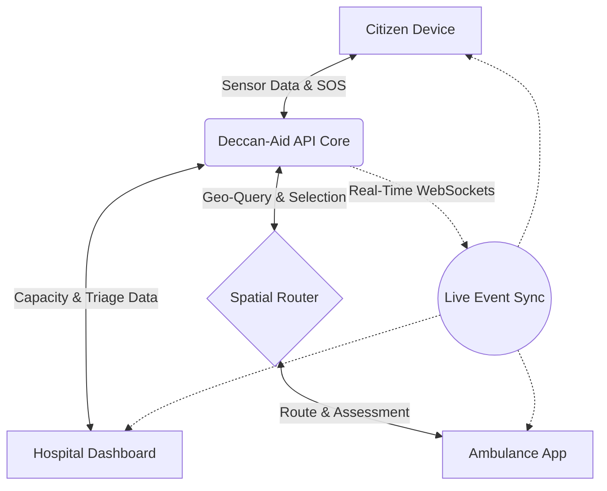

# Solution Overview: Deccan-Aid (SmartAid) Platform

## Executive Summary
Deccan-Aid (formerly SmartAid) is a next-generation, AI-powered emergency medical response ecosystem engineered to eradicate the systemic latency that costs lives during critical incidents. By seamlessly integrating mobile edge computing, real-time geospatial intelligence, and artificial intelligence into a unified platform, Deccan-Aid transforms emergency dispatch from a reactive, human-bottlenecked process into a proactive, instantaneous orchestration of care. The platform connects citizens, ambulance fleets, and critical care facilities through a central digital nervous system, ensuring that the nearest asset reaches the patient faster, and the most appropriate hospital is prepared upon arrival.

## Vision Statement
**What future is Deccan-Aid trying to create?**
We envision a future where the concept of "waiting for an ambulance" is fundamentally obsolete. We are building a world where medical emergencies are detected the millisecond they occur, where emergency vehicles arrive guided by preemptive intelligence rather than frantic phone calls, and where every trauma patient is met at the hospital door by a surgical team that has been anticipating their exact arrival and medical condition.

## Mission Statement
To radically reduce emergency medical response times and eliminate preventable mortality by digitizing and orchestrating the entire pre-hospital care spectrum through artificial intelligence, sensor-fusion, and real-time connectivity.

## Core Objectives
* **Faster Emergency Response:** Reduce average ambulance dispatch times to under 60 seconds through algorithmic matching.
* **Better Ambulance Utilization:** Maximize fleet efficiency through dynamic, location-aware deployment rather than static stationing.
* **Improved Hospital Coordination:** Eradicate secondary transfers by ensuring ambulances only transport patients to hospitals with confirmed, real-time capacity.
* **Reduced Communication Delays:** Replace chaotic radio chatter with structured, instant digital data transmission across all stakeholders.
* **Enhanced Patient Outcomes:** Maximize the "Golden Hour" of trauma intervention by providing medical professionals earlier access to the patient and their data.

---

## Solution Overview
The traditional 911/112 model operates via a linear relay: Citizen -> Dispatcher -> Driver -> Hospital. Deccan-Aid shatters this linearity by introducing a synchronous, hub-and-spoke ecosystem. Powered by a robust Flutter frontend and a high-performance FastAPI/MongoDB backend, Deccan-Aid provides a ubiquitous digital layer over the city. 

When an emergency occurs, smartphone sensors detect the crash geometry and trigger an instant SOS, or the citizen initiates a one-tap manual SOS. Instantly, the platform’s spatial engine queries the exact coordinates of every active ambulance via the Google Maps Platform. The optimal unit is assigned autonomously. Simultaneously, the backend notifies nearby network hospitals of the incoming trauma, sharing the AI-calculated severity. The citizen watches the ambulance on a live map, while the hospital tracks the inbound ETA, effectively moving the hospital's triage capabilities to the trauma scene.

---

## Stakeholders

### Citizens
**Benefits and Value:**
* **Instant Rescue:** Bypass busy dispatch call centers.
* **Incapacitation Protection:** Mobile sensors trigger help even if the user is unconscious.
* **Anxiety Reduction:** Watch the ambulance drive to the exact location via a real-time Google Map interface, eliminating the panic of "are they coming?"
* **First-Aid Guidance:** AI (Google Gemini) provides immediate survival instructions while waiting.

### Ambulance Drivers
**Benefits and Value:**
* **Frictionless Dispatch:** Receive exact GPS coordinates instantly on a digital interface, avoiding address confusion.
* **Optimized Routing:** Navigate through traffic dynamically using integrated Google Maps wayfinding.
* **Guaranteed Admissions:** Deliver patients with confidence, knowing the destination hospital has already accepted the inbound transfer.
* **Digital Handovers:** Transmit preliminary injury reports digitally to the hospital en route.

### Hospitals
**Benefits and Value:**
* **Predictive Triage:** See the severity and ETA of incoming patients before they breach the hospital doors.
* **Dynamic Capacity Control:** Manage ICU bed, general bed, and surgical team availability via a live digital dashboard, preventing dangerous overcrowding.
* **Streamlined Handover:** ER physicians review the driver's submitted injury assessment on their screens, allowing them to prepare blood products or surgical instruments in advance.

### Emergency Services (Command Center)
**Benefits and Value:**
* **Macro-Visibility:** "God-mode" overview of all active ambulances, incidents, and hospital capacities across the metropolis.
* **Surge Management:** Ability to dynamically re-allocate entire fleets during mass-casualty events using real-time analytics.
* **Reduced Call Volume:** Automated AI handling of localized emergencies frees up human operators for complex edge cases.

### Family Members
**Benefits and Value:**
* **Information Parity:** Trusted contacts receive instant notifications when an auto-SOS is triggered, along with the dispatched hospital name.
* **Peace of Mind:** Complete transparency of the patient's logistical journey from the street to the operating room.

---

## Platform Ecosystem

The Deccan-Aid ecosystem is built on continuous, concurrent data loops.

* **Information Flow:** Data originates at the edge (the citizen's smartphone sensors or manual input). It flows to the FastAPI core, where it is instantly structured and pushed outward simultaneously. Drivers receive location data; hospitals receive trauma data.
* **Communication Flow:** Real-time WebSockets replace asynchronous HTTP requests. When an ambulance accepts a ride, the citizen’s UI updates in milliseconds. Communication is visual and data-driven rather than verbal and error-prone.
* **Decision Flow:** Algorithmic bias dictates the highest-priority decisions (e.g., dispatching the nearest driver). Human-in-the-loop decisions (like a hospital accepting an admission) are executed digitally via the dashboard, immediately rippling consequences out to the driver and citizen via the notification relay.

---

## Core Platform Components

### Mobile Application
The Flutter-based consumer surface. Responsible for edge computing (sensor polling), rendering Google Maps for live tracking, and housing the Gemini AI chat interface. It acts as both the trigger mechanism and the reassurance interface.

### Emergency Dispatch Layer
The backend spatial engine. Responsible for intercepting SOS packets, executing MongoDB 2dsphere `$near` queries against the live driver database, and orchestrating the assignment logic in under 100 milliseconds.

### AI Intelligence Layer
Integrates Google Gemini to parse user distress messages, classify emergency types, provide life-saving first-aid instructions, and analyze accelerometer arrays to score crash severity.

### Hospital Coordination Layer
A robust state-management web dashboard. Responsible for providing hospitals with CRUD operations over their physical capacity (beds, surgeons) and a queuing interface to accept or reject inbound ambulance vectors.

### Real-Time Tracking Layer
Built on Socket.IO, this layer pushes coordinate deltas (latitude/longitude shifts) from the driver to the backend, and instantly broadcasts them to the patient and hospital interfaces for smooth 60fps map animation.

### Notification Layer
Powered by Firebase Authentication and cloud messaging, this component ensures that offline devices, sleeping phones, or distant family members receive critical push alerts the second a disaster strikes.

---

## Key Features

### One-Tap SOS
A highly prominent, universally accessible panic button that extracts exact device GPS coordinates and fires a high-priority packet to the dispatch layer instantly.

### Automatic Accident Detection
Background services poll the device's accelerometer and gyroscope at 100ms intervals. Hard impacts (e.g., > 25 m/s² deceleration) immediately auto-fire an SOS packet without user intervention.

### Intelligent Ambulance Assignment
Replaces human dispatchers by mathematically determining the fastest responder based on raw distance, active driver status, and traffic telemetry, ensuring optimal fleet utilization.

### Real-Time Tracking
A seamless map interface showing the ambulance carving through traffic toward the patient. Displays a highly accurate ETA, dynamically adjusted by speed and route.

### Hospital Capacity Awareness
Ambulances only view hospitals on their map that have digitally broadcasted an "open" status for critical care beds, physically preventing chaotic ER diversions.

### Emergency Severity Classification
AI models classify incidents into High, Medium, or Low severity based either on raw crash metrics or parsing the user's manual injury description, allowing hospitals to prepare accordingly.

### AI Emergency Guidance
While waiting for the 5-8 minutes it takes the ambulance to arrive, the Gemini AI provides the caller with tailored, calm instructions (e.g., "Apply pressure to the wound with a clean cloth" or "Perform CPR at 100 beats per minute").

### Admission Coordination
A digital handshake before arrival. The driver transmits an injury report; the hospital hits "Accept Transfer," guaranteeing a bed is waiting when the siren stops.

---

## User Experience Journeys

### Citizen Journey

| Step | Action | System Response |
| :--- | :--- | :--- |
| **1. Incident** | User presses SOS or crashes car. | System captures coordinates, calculates severity. |
| **2. Triage** | User interacts with Gemini AI. | Backend assigns nearest driver instantly. |
| **3. Waiting** | User watches map interface. | WebSockets stream the ambulance's live location. |
| **4. Transit** | Ambulance arrives and picks up user. | App transitions to "En Route to Hospital X". |

### Driver Journey

| Step | Action | System Response |
| :--- | :--- | :--- |
| **1. Idle** | Driver marked as "Available" in app. | Backend tracks location every 5 seconds. |
| **2. Alert** | Loud alarm sounds on driver's tablet. | Displays exact location, distance, and severity. |
| **3. Accept** | Driver presses "Accept". | Navigation launches; patient notified. |
| **4. Transport** | Driver clicks "Patient Picked Up". | Submits injury form; requests hospital admission. |

### Hospital Journey

| Step | Action | System Response |
| :--- | :--- | :--- |
| **1. Preparation** | Admin logs into dashboard. | Sets ICU capacity to "5 beds available". |
| **2. Incoming** | Dashboard flashes red with incoming request. | Views patient severity and driver's notes. |
| **3. Acceptance** | Doctor clicks "Accept Patient". | Notifies driver they are cleared for arrival. |
| **4. Handover** | Ambulance arrives at ER. | Digital record is transferred to EHR seamlessly. |

---

## Innovation Highlights

* **AI-First Emergency Response:** We use AI not as an afterthought, but as the initial triage layer and crash detection mechanism, decoupling human consciousness from the ability to call for help.
* **Sub-Second Real-Time Coordination:** Transitioning traditional HTTP infrastructure to Persistent WebSockets ensures that the map the patient sees is exactly where the ambulance is, with zero polling latency.
* **Mobile Sensor Edge Computing:** Pushing crash detection algorithms to the mobile client (Edge) ensures instant response without burdening the cloud with constant stream uploads.
* **Digital Healthcare Orchestration:** Solving the "Ambulance Diversion" crisis by treating hospitals, vehicles, and patients as a fluid, interconnected digital network rather than isolated silos.

---

## Expected Outcomes

* **Reduced Response Time:** Targeting a drop from a 15-minute average to a sub-8-minute average in dense urban centers.
* **Faster Admissions:** Target zero hospital diversions through preemptive capacity coordination.
* **Better Ambulance Utilization:** Fleet telemetry analysis ensures vehicles spend less time idly returning to static stations and more time patrolling predicted high-incident zones.
* **Better Hospital Preparedness:** Trauma teams gain a 10-minute head start on preparing operating theaters.

---

## Business and Social Impact

* **Public Safety Benefits:** A tangible reduction in traffic fatalities, stroke mortality, and cardiac arrest deaths through sheer speed of intervention.
* **Healthcare Benefits:** Massively reduces burnout among emergency room nurses and EMS crews by providing structured, predictable patient flows.
* **Economic Benefits:** Reduces massive costs associated with long-term disability directly caused by delayed initial medical intervention.
* **Community Impact:** Mends the shattered trust between citizens and public infrastructure, reassuring the public that help is an instant, digital guarantee.

---

## Future Vision

Deccan-Aid is designed to scale beyond the immediate EMS crisis. 
* **Smart City Integration:** Future versions will integrate directly with municipal traffic management systems, autonomously changing traffic lights to green as the ambulance approaches intersections.
* **Connected Healthcare:** Deep integration with national Electronic Health Record (EHR) databases to instantly pull patient medical histories upon SOS activation.
* **Wearable Integration:** Expanding sensor-fusion from the smartphone to the smartwatch (e.g., detecting heart rate anomalies and autonomously dispatching an ambulance for severe arrythmia).
* **Predictive Dispatch:** Using machine learning on historical trauma data to pre-position ambulances in specific neighborhoods during high-risk hours, cutting response times to mere seconds.

---

## Conclusion
The architecture of survival is fundamentally a data problem. By the time a traditional dispatcher answers a phone call, Deccan-Aid has already detected the accident, dispatched the vehicle, notified the hospital, and guided the rescue. At its core, Deccan-Aid does not just modernize the ambulance—it completely reinvents the timeline of human survival. By merging Google's spatial intelligence, Gemini's cognitive parsing, and high-velocity systems architecture, we are building a paradigm where emergency response is seamless, autonomous, and instant.
