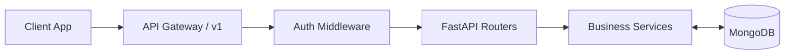

# API Design Specification: SmartAid (Deccan-Aid)

## Introduction
The SmartAid platform relies on a high-velocity, bidirectional data layer to orchestrate life-saving operations. This API Design Specification serves as the definitive contract between the Flutter mobile frontends, the hospital web dashboards, and the FastAPI/MongoDB backend. Its primary goal is to ensure that all data exchanges are structured, secure, predictable, and optimized for sub-second emergency response.

## API Design Principles
*   **RESTful Design:** Standardized semantic use of HTTP methods (GET, POST, PUT, PATCH, DELETE) mapped logically to business entities.
*   **Scalability:** Stateless HTTP endpoints (except for WebSocket streams) allowing horizontal scaling across asynchronous Uvicorn workers.
*   **Consistency:** A strict separation of HTTP verbs, uniform pagination standards, and identical envelope structures for all response payloads.
*   **Security:** Enforced JSON Web Token (JWT) Bearer authentication, Role-Based Access Control (RBAC), and SSL/TLS encryption.
*   **Versioning:** All routes are prefixed with the API version to allow structural evolution without breaking existing mobile clients.
*   **Backward Compatibility:** Future changes will be strictly additive until the endpoint is officially deprecated in a major version bump.

## API Architecture

**Base URL:** 
`https://api.deccan-aid.com/api/v1`

**Resource Structure:** Nouns are pluralized (e.g., `/users`, `/emergencies`). Action-oriented endpoints are localized under specific resource IDs (e.g., `/drivers/assignments/{id}/accept`).

**Authentication Model:** OAuth2 with Bearer token (JWT). Standard 1-hour expiration with rotating refresh tokens.

**Request Lifecycle:**
1. Ingress (Nginx/API Gateway)
2. CORS & Rate Limit Middleware
3. Auth Dependencies (Token validation -> Role extraction)
4. Pydantic Model Validation (Throws 422 immediately if malformed)
5. Service Layer execution
6. Standard JSON Response Envelope



---

## Authentication APIs

### Register User
**POST** `/auth/register`
*   **Purpose:** Create a new identity footprint.
*   **Request:**
    ```json
    { "email": "test@test.com", "password": "SecurePassword123!", "role": "citizen" }
    ```
*   **Validation Rules:** Valid email format, strong password regex, recognized role.
*   **Response:** 201 Created. `{"access_token": "eyJ...", "refresh_token": "abc..."}`
*   **Error Responses:** 409 Conflict (User exists).

### Login
**POST** `/auth/login`
*   **Purpose:** Authenticate and return JWT.
*   **Request:** Standard OAuth2 form or JSON payload.
*   **Response:** 200 OK. `{"access_token": "...", "token_type": "bearer"}`
*   **Error Responses:** 401 Unauthorized (Invalid credentials).

### Refresh Token
**POST** `/auth/refresh`
*   **Purpose:** Exchange a valid refresh token for a new access token.

### Logout
**POST** `/auth/logout`
*   **Purpose:** Blacklist the current token/session.

---

## User Management APIs

*   **GET** `/users/me`: Fetch authenticated user identity and role.
*   **PATCH** `/users/me`: Partially update core user fields (e.g., phone number).
*   **PUT** `/users/me/medical-profile`: Overwrite entire medical profile (blood type, allergies).
    *   *Validation:* Enforce valid blood type enums.
*   **PUT** `/users/me/emergency-contacts`: Update family notification list.
*   **GET** `/users/me/history`: Fetch paginated list of past emergency requests.

---

## Emergency APIs

### Create Emergency Request
**POST** `/emergency`
*   **Request:**
    ```json
    {
      "location": {"lat": 12.9716, "lng": 77.5946},
      "source": "manual",
      "severity": "high",
      "nature_of_emergency": "Severe chest pain"
    }
    ```
*   **Response:** 201 Created. `{"data": {"request_id": "abc-123", "status": "pending"}}`

### Retrieve Emergency
**GET** `/emergency/{id}`
*   **Response:** 200 OK. Returns full documented state of the ongoing emergency.

### Other Emergency Routes
*   **GET** `/emergency/history`: Paginated archive of all emergencies.
*   **POST** `/emergency/{id}/cancel`: Halts dispatch if ambulance has not yet arrived.
*   **GET** `/emergency/active`: Fetches the user's currently active unclosed emergency.

---

## Dispatch APIs

*   **GET** `/dispatch/nearby-drivers`: Used by backend services/admins to view available spatial assets.
*   **POST** `/dispatch/assign`: Internal command initiating algorithmic matching.
*   **POST** `/dispatch/reassign`: System command forcing the release and re-computation of a driver lock.
*   **GET** `/dispatch/status`: Pings the current state of the matching algorithm.

*Dispatch Lifecycle:* `Pending -> Searching -> Locked -> DriverPinged -> Accepted/Rejected.`

---

## Driver APIs

*   **GET** `/drivers/me`: Pull driver telemetry stats and current state.
*   **PATCH** `/drivers/status`: Toggle `available` / `offline`.
*   **PATCH** `/drivers/location`: Low-frequency polling endpoint (use WebSocket for high-frequency).
*   **GET** `/drivers/assignments`: Fetch current active mandate.
*   **POST** `/drivers/assignments/{id}/accept`: Commits driver to an SOS.
*   **POST** `/drivers/assignments/{id}/reject`: Returns assignment to dispatch pool.
*   **POST** `/drivers/assignments/{id}/complete`: Submits medical form, marks incident closed.

---

## Hospital APIs

*   **GET** `/hospitals`: Paginated directory.
*   **GET** `/hospitals/nearby`: Requires `?lat=&lng=&radius=`.
*   **GET** `/hospitals/{id}`: Fetch static hospital details.
*   **PATCH** `/hospitals/capacity`: 
    ```json
    { "icu_beds": 4, "general_beds": 12 }
    ```
*   **GET** `/hospitals/admissions`: Dashboard polling for inbound patients.
*   **POST** `/hospitals/admissions/{id}/accept`: ER commits to taking the inbound patient.
*   **POST** `/hospitals/admissions/{id}/reject`: ER rejects due to capacity bounds.

---

## Tracking APIs

*   **POST** `/tracking/start`: Initiates a route record, returns a `SessionId`.
*   **PATCH** `/tracking/location`: 
    ```json
    { "session_id": "xyz", "lat": 12.0, "lng": 77.0, "speed": 40.5 }
    ```
*   **GET** `/tracking/{sessionId}`: Fetch the latest known point and ETA.
*   **GET** `/tracking/{sessionId}/history`: Returns the time-series array of the entire route.

---

## Notification APIs

*   **GET** `/notifications`: Pull inbox alerts.
*   **PATCH** `/notifications/{id}/read`: Mark single alert read.
*   **PATCH** `/notifications/read-all`: Bulk mark action.

---

## AI APIs

### Assess Emergency
**POST** `/ai/assess-emergency`
*   **Input:** User text ("My father is clutching his chest and can't breathe").
*   **Output:** `{"severity": "high", "confidence": 0.98}`

### Recommend Hospital
**POST** `/ai/recommend-hospital`
*   **Input:** Patient trauma matrix + Hospital proximity array.
*   **Output:** Ranked list of optimal ER routing choices.

### First Aid Guidance
**POST** `/ai/first-aid-guidance`
*   **Input:** Symptom string.
*   **Output:** Contextual MD safety guidelines.

### Analyze Accident
**POST** `/ai/analyze-accident`
*   **Input:** `{"accel_graph": [...], "gyro_graph": [...]}`
*   **Output:** `{"crash_severity": "critical", "trigger_auto_sos": true}`
*   *Fallback:* If Gemini times out, defaults to strict mathematical thresholds.

---

## Administrative APIs

*   **GET** `/sys/health`: Docker/K8s liveness probe.
*   **GET** `/sys/analytics`: High-level aggregated statistics.
*   **GET** `/sys/audit-logs`: Searchable chronological ledger of system actions.
*   **GET** `/sys/metrics`: Prometheus-compatible exposition.

---

## Standard Request Model

**Headers:**
*   `Authorization: Bearer <token>`
*   `X-Correlation-ID: <uuid>` (Client-generated UUID for tracing logs across microservices).
*   `Content-Type: application/json`

---

## Standard Response Model

**Success Response:**
```json
{
  "success": true,
  "data": { ... },
  "meta": { "timestamp": "2026-06-13T12:00:00Z" }
}
```

**Error Response:**
```json
{
  "success": false,
  "error": {
    "code": "VALIDATION_FAILED",
    "message": "The coordinates provided are out of bounds."
  },
  "trace_id": "abc-1234-xyz"
}
```

**Pagination Response:**
```json
{
  "success": true,
  "data": [ ... ],
  "pagination": {
    "total": 150,
    "page": 1,
    "limit": 20,
    "next_url": "/api/v1/hospitals?page=2"
  }
}
```

---

## Error Handling Strategy

*   **400 Bad Request:** Domain violations (e.g., trying to cancel a closed emergency).
*   **401 Unauthorized:** Missing or expired JWT.
*   **403 Forbidden:** Valid JWT, but role (e.g. Citizen) lacks privilege for endpoint (e.g. Hospital Capacity patch).
*   **404 Not Found:** Resource ID does not exist.
*   **422 Unprocessable Entity:** Pydantic schema validation failures (data type mismatch).
*   **429 Too Many Requests:** Throttled due to abnormal burst traffic.
*   **500 Internal Server Error:** Unhandled exception (logs alert to Sentry).

---

## WebSocket Design

Unlike REST, the tracking and dispatch layers utilize Socket.IO (`/ws`) for persistent bidirectional state transfer.

*   **Connection Lifecycle:** Client connects -> Authenticates securely -> Emits 'join_room' -> Listens for events.
*   **Authentication:** Token is passed in the initial handshake headers or query payload.
*   **Rooms:**
    *   `drivers_global`: System-wide dispatch broadcast.
    *   `request_{id}`: Isolated room for a specific emergency incident.
    *   `hospital_{id}`: Isolated room for specific hospital metrics.

**Required Events:**
*   `sos_created`: Emitted to `drivers_global`.
*   `sos_updated`: Emitted to `request_{id}`.
*   `ambulance_assigned`: Emitted to driver directly.
*   `driver_accepted`: Emitted to `request_{id}`.
*   `driver_location_updated`: Emitted to `request_{id}` (Contains delta coordinates).
*   `hospital_selected`: Emitted to `hospital_{id}`.
*   `hospital_accepted`: Emitted to `request_{id}`.
*   `notification_created`: Emitted to specific user namespace.

---

## API Security

*   **JWT:** 60-minute lifetime, HS256 algorithm.
*   **Role-Based Access (RBAC):** Middleware decorators enforce strictly scoped permissions (e.g. `@requires("driver")`).
*   **Rate Limiting:** IP-based token bucket algorithm preventing brute-force login attacks.
*   **Input Validation:** Pydantic strips out unmapped JSON fields preventing NoSQL Injection.
*   **Audit Logging:** Mutative requests (POST/PATCH/DELETE) automatically commit a trace log to the `audit_logs` collection.

---

## API Versioning Strategy

*   **Current Iteration:** `/api/v1` - Fast moving, highly aggressive iteration.
*   **Future Strategy:** `/api/v2` will be established if profound data-structure paradigms shift.
*   **Deprecation Process:** Endpoints marked for obsolescence will include `Deprecation: true` headers 3 months prior to blackout. 

---

## Performance Requirements

*   **Response Time Targets:** 
    *   Read endpoints (GET): < 50ms at P95.
    *   Write endpoints (POST): < 150ms at P95.
*   **Concurrency Targets:** Handle up to 10,000 concurrent REST HTTP connections and 5,000 concurrent persistent WebSockets per regional instance.
*   **Real-Time Latency Targets:** WebSocket payloads must reach subscribing clients < 120ms from ingestion.

---

## OpenAPI Documentation Strategy

*   **Swagger UI:** Found at `/docs`, offering interactive form interfaces to test endpoints with live tokens.
*   **ReDoc:** Found at `/redoc`, offering a clean, linear reading experience tailored for third-party medical integrations.
*   **Developer Experience:** Every endpoint defined in FastAPI utilizes precise dependency injection, comprehensive docstrings, and rich Pydantic response models, effectively auto-generating a pixel-perfect API reference without manual maintenance overhead.

---

## Conclusion
The SmartAid API interface is engineered for deterministic, high-throughput efficiency. By standardizing exactly how the Flutter application talks to the backend logic, we enforce a strict barrier where complex geospatial math, AI prompt engineering, and state negotiations remain hidden within the backend services. The result is a robust, clean contract allowing mobile developers to build rapidly without worrying about the underlying emergency logistical chaos.
