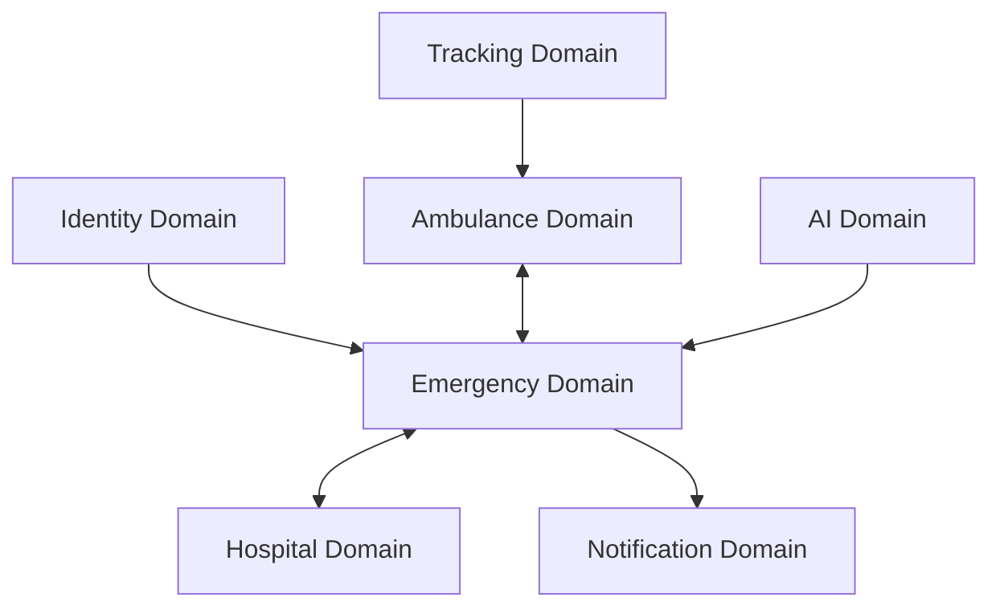
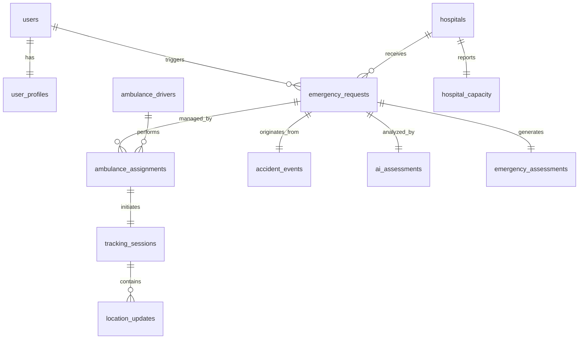

# Database Schema Specification: SmartAid (Deccan-Aid)

## Introduction
The SmartAid platform operates in a high-stakes, life-or-death environment where data latency translates directly into delayed medical intervention. The primary goal of the SmartAid database architecture is to provide sub-millisecond, highly available read/write capabilities while ensuring transactional integrity during the chaotic orchestration of emergency assets.

**Why MongoDB Atlas?**
MongoDB Atlas was selected due to its native support for geospatial indexing (2dsphere protocols), which is mandatory for algorithmic ambulance routing. Furthermore, its document-oriented structure seamlessly accommodates the polymorphic nature of emergency assessments and AI context payloads, while the managed Atlas cluster guarantees the 99.995% uptime SLA critical for emergency services.

---

## Database Design Principles
*   **Scalability:** The architecture favors horizontal sharding by geographic nodes, allowing the system to scale infinitely as additional cities are onboarded without degrading dispatch latency.
*   **Availability:** Multi-region replica sets ensure that local cloud-provider outages do not cripple the emergency dispatch network.
*   **Performance:** Unbounded document growth is strictly prevented (e.g., using bucketing for `location_updates`), ensuring working sets fit entirely in RAM.
*   **Consistency:** Eventual consistency is acceptable for analytics, but strict causal consistency is enforced during the `Ambulance Assignment` transaction phase to prevent dual-dispatching.
*   **Security:** Field-Level Encryption (FLE) is implemented for all Protected Health Information (PHI).
*   **Auditability:** Every schema mutation and state transition is immutably recorded in the audit log for legal and compliance requirements.

---

## High-Level Data Architecture

The database is divided into specialized operational bounded contexts:

1.  **Identity Domain:** Auth, Roles, and core identity.
2.  **Emergency Domain:** Crisis intake and request lifecycles.
3.  **Ambulance Domain:** Fleet telemetry and status.
4.  **Hospital Domain:** Destination metrics and capacity tracking.
5.  **Tracking Domain:** High-frequency spatial streaming arrays.
6.  **AI Domain:** Sensor payloads and ML assessment vectors.
7.  **Notification Domain:** Messaging queues and read-receipts.



---

## Collection Overview

| Collection Name | Purpose | Owner | Retention Strategy |
| :--- | :--- | :--- | :--- |
| `users` | Base authentication and RBAC | Auth Service | Eternal |
| `user_profiles` | PII and medical histories | Identity Service | Eternal |
| `emergency_requests` | Central nexus for high-priority SOS events | Dispatch Engine | 10 Years (Archived) |
| `emergency_assessments` | Medical triage data | Triage Service | 10 Years (Archived) |
| `ambulance_drivers` | Vehicle metadata and current state | Fleet Service | Eternal |
| `ambulance_assignments` | Linking tables bridging Drivers to Requests | Dispatch Engine | 10 Years (Archived) |
| `hospitals` | Hospital geospatial metadata | Facility Service | Eternal |
| `hospital_capacity` | Real-time counting of ICU/Trauma beds | Facility Service | Ephemeral (overwritten) |
| `tracking_sessions` | Parent container for physical routing | Telemetry Service | 30 Days (Archived) |
| `location_updates` | High-frequency spatial points (Bucketed) | Telemetry Service | TTL: 7 Days |
| `notifications` | Async push payloads | Messaging Service | TTL: 30 Days |
| `accident_events` | Raw g-force hardware sensor dumps | AI Service | TTL: 90 Days |
| `ai_assessments` | Gemini severity classifications | AI Service | 10 Years (Archived) |
| `audit_logs` | Immutable system action ledgers | Compliance | 10 Years (Cold Storage) |

---

## Collection Specifications

### 1. `users`
*   **Purpose:** Core identity provider lookup.
*   **Document Structure:**
    ```json
    {
      "_id": "ObjectId",
      "email": "janedoe@example.com",
      "phone": "+1234567890",
      "role": "citizen",
      "auth_provider": "firebase",
      "status": "active",
      "created_at": "ISODate",
      "updated_at": "ISODate"
    }
    ```
*   **Relationships:** 1:1 with `user_profiles`.
*   **Indexes:** Unique on `email`, `phone`.

### 2. `user_profiles`
*   **Purpose:** Stores specific patient medical context (PHI).
*   **Document Structure:**
    ```json
    {
      "user_id": "ObjectId",
      "full_name": "Jane Doe",
      "blood_group": "O-",
      "allergies": ["Penicillin"],
      "medical_notes": "Asthmatic",
      "emergency_contacts": [{"name": "John", "phone": "+0987654321"}],
      "date_of_birth": "ISODate",
      "gender": "F"
    }
    ```
*   **Relationships:** Belongs to `users`.

### 3. `emergency_requests`
*   **Purpose:** The central systemic orchestrator document.
*   **Document Structure:**
    ```json
    {
      "request_id": "ObjectId",
      "citizen_id": "ObjectId",
      "location": {
        "type": "Point",
        "coordinates": [77.5946, 12.9716]
      },
      "severity": "high",
      "status": "assigned",
      "source": "auto",
      "created_at": "ISODate",
      "assigned_at": "ISODate",
      "closed_at": null
    }
    ```
*   **Relationships:** HasOne `user_profiles`, HasMany `ambulance_assignments`.
*   **Indexes:** 2dsphere on `location`, Compound on `[status, created_at]`.

### 4. `emergency_assessments`
*   **Purpose:** Triage profiling submitted by AI or Driver.
*   **Document Structure:**
    ```json
    {
      "assessment_id": "ObjectId",
      "request_id": "ObjectId",
      "assessment_source": "driver",
      "severity": "critical",
      "risk_score": 85,
      "notes": "Suspected spinal compression."
    }
    ```

### 5. `ambulance_drivers`
*   **Purpose:** Fleet indexing engine.
*   **Document Structure:**
    ```json
    {
      "driver_id": "ObjectId",
      "vehicle_number": "KA-01-AB-1234",
      "license_number": "DL123456",
      "availability": "available",
      "current_location": {
        "type": "Point",
        "coordinates": [77.5800, 12.9800]
      }
    }
    ```
*   **Relationships:** HasMany `ambulance_assignments`.
*   **Indexes:** 2dsphere on `current_location`, Index on `availability`.

### 6. `ambulance_assignments`
*   **Purpose:** Transactional bridge avoiding locking the `emergency_requests` collection heavily.
*   **Document Structure:**
    ```json
    {
      "assignment_id": "ObjectId",
      "request_id": "ObjectId",
      "driver_id": "ObjectId",
      "status": "accepted",
      "accepted_at": "ISODate",
      "completed_at": null
    }
    ```

### 7. `hospitals`
*   **Purpose:** Core hospital facility metadata.
*   **Document Structure:**
    ```json
    {
      "hospital_id": "ObjectId",
      "name": "City Core Trauma",
      "address": "123 Main St",
      "location": {
        "type": "Point",
        "coordinates": [77.6000, 12.9600]
      },
      "contact_details": {"phone": "111-222-3333"}
    }
    ```
*   **Indexes:** 2dsphere on `location`.

### 8. `hospital_capacity`
*   **Purpose:** The dynamically updated availability counter.
*   **Document Structure:**
    ```json
    {
      "hospital_id": "ObjectId",
      "icu_beds": 3,
      "general_beds": 42,
      "doctors_available": 12,
      "last_updated": "ISODate"
    }
    ```

### 9. `tracking_sessions`
*   **Purpose:** Metadata for a tracking event.
*   **Document Structure:**
    ```json
    {
      "session_id": "ObjectId",
      "request_id": "ObjectId",
      "driver_id": "ObjectId",
      "status": "active",
      "started_at": "ISODate",
      "ended_at": null
    }
    ```

### 10. `location_updates`
*   **Purpose:** High velocity bucketed timeline containing the breadcrumb trail.
*   **Document Structure:**
    ```json
    {
      "session_id": "ObjectId",
      "latitude": 12.9719,
      "longitude": 77.5948,
      "speed": 45.5,
      "timestamp": "ISODate"
    }
    ```

### 11. `notifications`
*   **Purpose:** Messaging bus queue.
*   **Document Structure:**
    ```json
    {
      "recipient_id": "ObjectId",
      "notification_type": "sms",
      "message": "Ambulance arriving in 2 mins.",
      "status": "sent",
      "sent_at": "ISODate"
    }
    ```

### 12. `accident_events`
*   **Purpose:** The raw hardware payload triggered by an iOS/Android fall detector.
*   **Document Structure:**
    ```json
    {
      "event_id": "ObjectId",
      "sensor_data": {"accel_max": 28.5, "gyro_max": 5.4},
      "severity": "high",
      "confidence": 0.95,
      "timestamp": "ISODate"
    }
    ```

### 13. `ai_assessments`
*   **Purpose:** LLM context parsing results.
*   **Document Structure:**
    ```json
    {
      "assessment_type": "chat_inference",
      "request_id": "ObjectId",
      "model": "gemini-1.5",
      "confidence": 0.88,
      "recommendation": "Elevate legs, suspect shock."
    }
    ```

### 14. `audit_logs`
*   **Purpose:** Legal and transactional history.
*   **Document Structure:**
    ```json
    {
      "entity_type": "admission",
      "entity_id": "ObjectId",
      "action": "rejected_capacity",
      "actor": "Admin_ID",
      "timestamp": "ISODate"
    }
    ```

---

## Entity Relationships



---

## Geospatial Design

All location-centric collections (`emergency_requests`, `ambulance_drivers`, `hospitals`) implement standard GeoJSON Point arrays.

**`2dsphere` Indexes:** These native MongoDB indexes map the geometry of an earth-like sphere, wrapping the date perfectly for haversine distance calculations.

**Optimized Routing Query:**
To find the closest ambulance, the dispatch engine executes a `$near` query on the `current_location` index of the `ambulance_drivers` table, pre-filtered by `availability: "available"`. Because the index natively sorts by physical distance, the query `limit(1)` accurately returns the absolute closest unit in sub-10 millisecond execution times.

---

## Indexing Strategy

| Collection | Index Fields | Type | Purpose |
| :--- | :--- | :--- | :--- |
| `users` | `email`, `phone` | Unique | Prevent duplicate identities |
| `emergency_requests` | `location` | 2dsphere | Heatmap rendering |
| `emergency_requests` | `status`, `created_at` | Compound | Fast queue aggregations |
| `ambulance_drivers` | `current_location` | 2dsphere | Spatial dispatch resolution |
| `hospitals` | `location` | 2dsphere | Nearby hospital finder |
| `location_updates` | `session_id`, `timestamp` | Compound | Replaying ambulance routes |
| `location_updates` | `timestamp` | TTL (7d) | Auto-delete massive stream arrays |
| `notifications` | `sent_at` | TTL (30d) | Space optimization |
| `audit_logs` | `entity_id` | Standard | Transactional tracing |

---

## Data Retention Strategy

*   **Operational Data (Users, Fleet, Facilities):** Retained eternally, acting as master records.
*   **Tracking Data (Coordinates):** Massive telemetry payloads are retained via a 7-Day TTL index. The `session` metadata is kept, but the raw point arrays are discarded to preserve I/O costs.
*   **Audit Data:** Archived to S3/Cold Storage via Atlas Data Lakes after 6 months to maintain compliance without cluttering hot storage.
*   **AI Data:** Retained aggressively (90 days hot) to feed internal ML retraining pipelines for severity scoring.
*   **Archived Data:** Requests older than 365 days are federated to cheap analytical nodes.

---

## Security and Compliance

*   **Medical Information Protection (HIPAA/GDPR):** `user_profiles` utilizes MongoDB Client-Side Field Level Encryption (CSFLE) specifically on `medical_notes` and `allergies` arrays. The cloud provider cannot read this data.
*   **Location Privacy:** Continuous tracking is strictly enforced to only operate when the driver state is `Busy/EnRoute`.
*   **Access Control:** strict Role-Based Access Controls inside the API layer validate roles (e.g. `driver` vs `admin`) before permitting database collection views.

---

## Performance Considerations

*   **Read Patterns:** Dispatching requires massive read throughput against the `ambulance_drivers` spatial index.
*   **Write Patterns:** `location_updates` handles intense I/O (writes every 5 seconds per active driver). The Bucketing Pattern is implemented (grouping points arrayed by minute into a single timestamp document) to reduce the sheer volume of `INSERT` commands.
*   **Sharding Considerations:** As SmartAid expands internationally, databases will be horizontally sharded using a hashed compound shard key based on `city_code` and `request_id`, ensuring regional requests isolate to regional shards.

---

## Backup and Disaster Recovery

*   **Backup Schedules:** Atlas continuous cloud backups enable Point-In-Time recovery to the exact second of a failure, guaranteeing no emergency request is "lost". Scheduled snapshotting occurs every 6 hours.
*   **High Availability:** Deployed on an M50 tier spanning 3 availability zones within AWS/GCP, guaranteeing auto-failover if the primary node detonates.

---

## Future Schema Evolution

SmartAid's document model ensures frictionless expansion:
*   **Wearables:** We can append a polymorphic `telemetry` array into the `accident_events` collection to handle Apple Watch API payloads without schema migrations.
*   **Traffic Systems:** Extending `hospital_capacity` logic to a new collection linking municipal intersections to active `tracking_sessions`.
*   **Emergency Drones:** A simple addition to the `ambulance_drivers` enum to include `vehicle_type: "Drone"`.

---

## Conclusion
The SmartAid database architecture elegantly balances the paradox of emergency software: requiring massive scale while simultaneously demanding uncompromisingly low latency. By leveraging MongoDB Atlas's 2dsphere indexes, strictly defining bounded geospatial contexts, and applying precise TTL lifecycle rules to telemetry data, this schema provides a bulletproof foundation capable of powering an entire smart city's emergency infrastructure.
