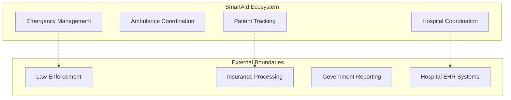
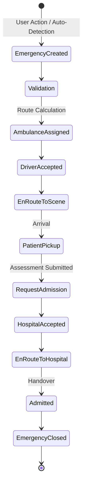
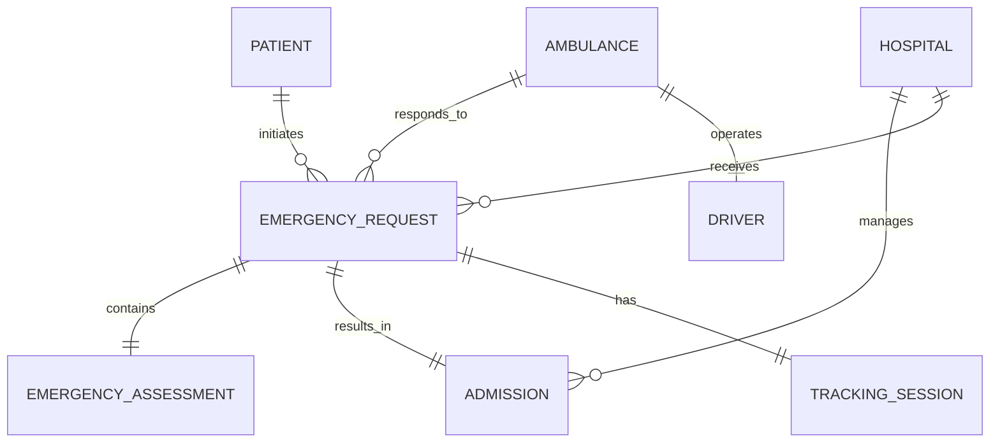

# Domain Model: SmartAid (Deccan-Aid) Emergency Response Platform

## Introduction
A domain model is a conceptual model of a specific business domain that incorporates both behavior and data. It captures the nomenclature, concepts, relationships, and logic of the problem space, acting as the ubiquitous language between technical and non-technical stakeholders. 

In SmartAid, domain modeling is paramount because emergency response involves extreme risk, complex legal/operational boundaries, and hard timing constraints. This document abstracts away from specific technologies (like Flutter or MongoDB) to define the pure business logic and operational entities that drive the SmartAid ecosystem.

---

## Business Domain Overview
The emergency response ecosystem is a high-velocity operational environment where rapid coordination between disparate entities determines patient survival. 

* **Emergency Incidents:** The inception of the workflow—either manually reported by a citizen or automatically detected via trauma sensors.
* **Response Coordination:** The matching of a crisis to the optimal mobile healthcare asset (the ambulance) based on spatial algorithms.
* **Resource Allocation:** Managing the availability and status of life-saving units and trauma beds across a metropolitan area.
* **Hospital Admission Workflows:** The digital handshake between pre-hospital care (the ambulance) and definitive care (the hospital emergency room) to ensure readiness prior to arrival.

---

## System Boundaries

### Inside SmartAid
* **Emergency Management:** Intake, classification, and tracking of active emergencies.
* **Ambulance Coordination:** Real-time spatial tracking, assignment, and status management of the ambulance fleet.
* **Hospital Coordination:** Digital capacity tracking and pre-arrival admission workflows.
* **Patient Tracking:** Monitoring the immediate spatial location and vital status of the patient during transport.

### Outside SmartAid
* **Law Enforcement:** Police dispatch and traffic control systems.
* **Insurance Processing:** Billing and claims systems.
* **Government Reporting:** Macro-level public health data warehouses.
* **External Healthcare Systems:** Internal hospital Electronic Health Records (EHR) not explicitly exposed for trauma triage.

---

## Core Actors

### Citizen
* **Responsibilities:** Accurately provide location/severity during emergencies.
* **Goals:** Receive immediate medical intervention.
* **Behaviors:** Trigger SOS, communicate injuries, await instructions.
* **Interactions:** Interfaces with the Emergency System to initiate a request; tracks Ambulance; communicates with AI Guidance.

### Ambulance Driver
* **Responsibilities:** Navigate to the patient safely; stabilize patient; transport to hospital.
* **Goals:** Minimize transit time; ensure safe transport and successful hospital handover.
* **Behaviors:** Accept/reject assignments; update status; submit assessments.
* **Interactions:** Receives assignments from Emergency System; transmits ETA to Hospital.

### Hospital Administrator
* **Responsibilities:** Maintain accurate facility capacity; approve/reject inbound transfers.
* **Goals:** Optimize ER throughput; prevent overcrowding.
* **Behaviors:** Update bed count; review incoming patient assessments.
* **Interactions:** Communicates acceptance to Ambulance Driver; prepares ER staff.

### Emergency Coordination System
* **Responsibilities:** Algorithmic matching; system-wide orchestration.
* **Goals:** Minimize system latency; ensure 100% assignment success.
* **Behaviors:** Route requests; monitor fleet; escalate failures.
* **Interactions:** Bridges Citizen, Driver, and Hospital.

### Family Member
* **Responsibilities:** Provide emergency biological/medical history if patient is incapacitated.
* **Goals:** Ensure relative's safety; locate the destination hospital.
* **Behaviors:** Receive alerts; track transit.
* **Interactions:** Read-only access to Tracking Context.

---

## Core Domain Entities

### Emergency Request
* **Purpose:** Represents a cry for help and its subsequent resolution.
* **Lifecycle:** Created -> Assigned -> En Route -> Admitted.
* **States:** Pending, Active, Resolved, Cancelled.
* **Attributes:** Severity, Coordinates, Timestamp, OriginType (Auto/Manual).
* **Relationships:** Belongs to Patient; Handled by Ambulance.

### Ambulance
* **Purpose:** The physical vehicle and crew capability.
* **Lifecycle:** Commissioned -> Active Duty -> Decommissioned.
* **States:** Available, Busy, Offline.
* **Attributes:** VehicleID, CurrentLocation, EquipmentLevel (BLS/ALS).
* **Relationships:** Assigned to Emergency Request.

### Hospital
* **Purpose:** The destination facility providing definitive care.
* **Lifecycle:** Onboarded -> Active -> Suspended.
* **States:** Accepting, Full Capacity.
* **Attributes:** Name, Location, ICUBeds, TraumaLevel.
* **Relationships:** Receives Emergency Requests.

### Patient
* **Purpose:** Beneficiary of the emergency service.
* **Lifecycle:** Registered -> Involved in Incident -> Stabilized.
* **States:** Safe, In Danger, In Transit, Under Care.
* **Attributes:** BloodGroup, Allergies, EmergencyContacts.
* **Relationships:** Initiates Emergency Request.

### Emergency Assessment
* **Purpose:** Clinical evaluation of the patient on-scene.
* **Lifecycle:** Drafted -> Submitted -> Reviewed.
* **States:** Preliminary, Final.
* **Attributes:** Vitals, TraumaDescription, SuspectedCondition.
* **Relationships:** Attached to Emergency Request.

### Location
* **Purpose:** Spatial representation of any asset.
* **Lifecycle:** Ephemeral (constantly updating).
* **States:** Static, Moving.
* **Attributes:** Latitude, Longitude, ErrorMargin.
* **Relationships:** Describes Patient, Ambulance, Hospital.

### Tracking Session
* **Purpose:** Time-bounded log of spatial movement.
* **Lifecycle:** Initiated -> Streaming -> Terminated.
* **States:** Active, Stale, Ended.
* **Attributes:** PathHistory, CurrentETA.
* **Relationships:** Tied to Ambulance and Emergency Request.

### Notification
* **Purpose:** Asynchronous system alert.
* **Lifecycle:** Generated -> Sent -> Delivered / Read.
* **States:** Unread, Read, Failed.
* **Attributes:** Payload, Priority, Timestamp.
* **Relationships:** Targets specific Actors.

---

## Domain Events

1. **SOS Triggered**
   * **Trigger:** Citizen presses panic button.
   * **Participants:** Citizen, Coordination System.
   * **Consequences:** Emergency Request created; Matching algorithm starts.
   * **Follow-up:** Broadcast to local fleet.

2. **Accident Detected**
   * **Trigger:** Fall/Crash sensors exceed thresholds.
   * **Participants:** Citizen Device, Coordination System.
   * **Consequences:** Auto-SOS created with high severity flag.
   * **Follow-up:** Attempt citizen confirmation; dispatch fallback.

3. **Ambulance Assigned**
   * **Trigger:** Coordination System logic identifies optimal unit.
   * **Participants:** Coordination System, Ambulance Driver.
   * **Consequences:** Driver receives high-priority alert.
   * **Follow-up:** Wait for driver acceptance.

4. **Driver Accepted Request**
   * **Trigger:** Driver confirms capability to respond.
   * **Participants:** Driver, Citizen.
   * **Consequences:** Request state changes; Tracking Session begins.
   * **Follow-up:** Citizen notified of ETA.

5. **Ambulance Arrived**
   * **Trigger:** Driver arrives at scene or geo-fencing triggers.
   * **Participants:** Driver, Citizen.
   * **Consequences:** Tracking pauses; Assessment phase begins.
   * **Follow-up:** Paramedics stabilize patient.

6. **Patient Picked Up**
   * **Trigger:** Driver confirms patient is loaded.
   * **Participants:** Driver.
   * **Consequences:** Hospital matching begins; transit routing starts.
   * **Follow-up:** Transmit Assessment to Hospital.

7. **Hospital Selected**
   * **Trigger:** Driver or System chooses destination facility.
   * **Participants:** Driver, Hospital Admin.
   * **Consequences:** Admission request placed.
   * **Follow-up:** Await hospital confirmation.

8. **Hospital Accepted Admission**
   * **Trigger:** Admin confirms bed availability.
   * **Participants:** Hospital Admin, Driver.
   * **Consequences:** ER routing confirmed.
   * **Follow-up:** ETA broadcast to ER staff.

9. **Patient Admitted**
   * **Trigger:** Physical handover at ER.
   * **Participants:** Driver, Hospital Admin.
   * **Consequences:** Emergency Request Closed; Tracking Session Ended.
   * **Follow-up:** Metrics archived; Driver marked Available.

---

## Emergency Lifecycle Model

---

## Entity Relationship Model

---

## Business Rules

1. An Emergency Request must have valid geospatial coordinates for dispatch.
2. One Emergency Request can only have one active Ambulance assignment.
3. An Ambulance marked "Offline" or "Busy" cannot accept new requests.
4. An Auto-SOS event forces a 5-second cooldown to prevent duplicate triggers.
5. A Tracking Session terminates immediately upon Emergency Closure.
6. A Driver can reject an assignment, returning the Request to the dispatch pool.
7. If all nearby Ambulances reject, the search radius is expanded by 50%.
8. A Hospital can reject an Admission if ICU capacity is exactly 0.
9. An Emergency Request cannot be closed before physical admission is recorded.
10. Only registered medical personnel can submit an Emergency Assessment.
11. Family Members can view ETA but cannot alter destination routes.
12. Severity Classifications (High/Medium/Low) dictate dispatch priority queues.
13. Auto-detected crashes default to High Severity.
14. Hospitals must update capacity metrics at least once every 12 hours.
15. If a driver loses network connection for >3 minutes, dispatch reroutes a backup.
16. A citizen can cancel an Emergency Request only before the Ambulance arrives.
17. Dispatch engine matches based on drive-time ETA, not straight-line distance.
18. Emergency Assessment data is encrypted at rest.
19. An Ambulance must input vehicle plates prior to entering 'Available' state.
20. Re-assignment is triggered if a Driver remains stationary for >4 minutes while En Route.
21. Patient vital profiles attach to the Request automatically upon creation.
22. The System logs every state transition for legal auditing.
23. Hospitals cannot view patient identities until Admission is requested.
24. A Driver cannot log off with an active Emergency Request.
25. Multiple SOS triggers within 100 meters are flagged as mass-casualty events.
26. Mass-casualty events bypass individual assignments for fleet-wide broadcasts.
27. A Driver must complete the medical handover checklist to close the event.
28. The AI Guidance system only offers first-aid advice, not diagnostic conclusions.
29. A Tracking Session broadcasts at exactly 5-second intervals.
30. Upon Admission Rejection, the System automatically suggests the next closest facility.

---

## Bounded Contexts

### Emergency Management Context
* **Responsibilities:** SOS intake, validation, lifecycle orchestration.
* **Entities:** Emergency Request, Patient.
* **Events:** SOS Triggered, Emergency Closed.

### Ambulance Operations Context
* **Responsibilities:** Fleet tracking, assignment matching, driver statuses.
* **Entities:** Ambulance, Driver.
* **Events:** Ambulance Assigned, Driver Accepted.

### Hospital Coordination Context
* **Responsibilities:** Bed capacity, admission workflows.
* **Entities:** Hospital, Admission.
* **Events:** Admission Requested, Hospital Accepted.

### Tracking Context
* **Responsibilities:** Spatial telemetry, ETA calculations.
* **Entities:** Tracking Session, Location.
* **Events:** Location Updated.

### AI Intelligence Context
* **Responsibilities:** NLP communication, Crash severity scoring.
* **Entities:** InteractionLog, SensorArray.
* **Events:** Accident Detected, Advice Generated.

*Context Interactions:* The Emergency Context acts as the orchestrator, subscribing to the Tracking Context for ETA and issuing commands to the Hospital Coordination Context for admission requests.

---

## Domain Services

* **Dispatch Service:** Coordinates the spatial algorithms calculating ETA and matching the best ambulance to a request.
* **Assignment Service:** Handles the transactional locking of a request to a driver (handling accept/reject events).
* **Tracking Service:** Ingests high-frequency coordinate deltas and smooths them into a route mapping session.
* **Assessment Service:** Wraps the medical payload submitted by drivers and routes it securely to hospitals.
* **Hospital Recommendation Service:** Queries nearby hospitals based on trauma constraints and current capacity metrics.

---

## Aggregate Design

* **Emergency AggregateRoot:** The `Emergency Request`. It enforces the consistency of the lifecycle (an assessment cannot exist without the request being in 'Pick Up' state).
* **Fleet AggregateRoot:** The `Ambulance`. Ensures consistency between driver state and assignment availability.
* **Facility AggregateRoot:** The `Hospital`. Ensures admission requests do not exceed reported bed capacity.

---

## Future Domain Expansion

* **Smart City Integration:** Routing data into municipal grids to turn specific traffic lights green ahead of traversing ambulances.
* **Wearable Devices:** Integrating API webhooks from smartwatches for heart-attack detection.
* **Emergency Drones:** A new subclass of "Ambulance" that flies automated external defibrillators (AEDs) to remote incidents.
* **Telemedicine:** Enabling live video feeds from the Ambulance Aggregate to the Hospital Aggregate.

---

## Conclusion
The SmartAid Domain Model is a rigorous, technology-agnostic blueprint of emergency logistics. By isolating bounded contexts (Tracking vs. Hospital Capacity) and defining strict transactional boundaries through aggregate roots, this model ensures that any underlying technology stack will behave predictably in a high-stakes, life-or-death environment. This abstraction layer is the foundation for all subsequent database schemas, API contracts, and user interfaces.
