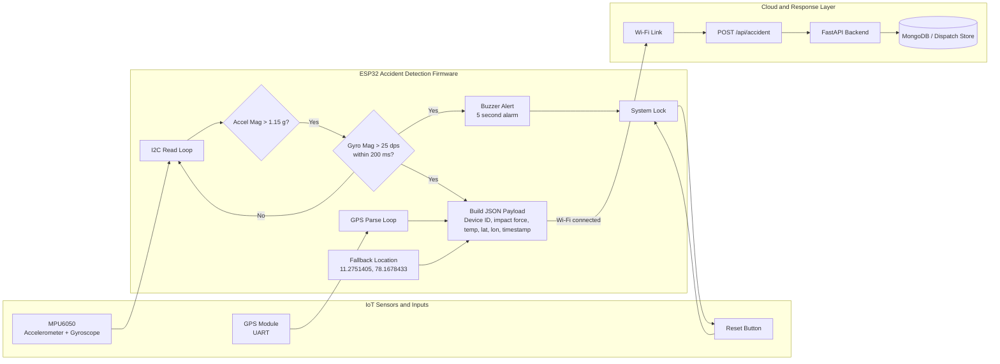

# IoT Edge Architecture for Accident Detection

This document describes the ESP32-based accident detection node implemented in the provided `.ino` firmware. The device acts as the edge layer in the Deccan-Aid system and converts sensor events into a single cloud alert.

## Edge Device Responsibilities

- Read accelerometer and gyroscope data from the MPU6050 over I2C.
- Read live GPS coordinates from the GPS module over UART.
- Detect an impact when acceleration crosses the configured threshold.
- Confirm the event when gyroscope rotation also crosses its threshold inside the confirmation window.
- Trigger the buzzer locally and lock the system after an alert.
- Send the accident payload to the backend over Wi-Fi.
- Fall back to a fixed location if GPS is not locked.

## Architecture Diagram



## Firmware Logic Map

1. Initialize I2C, UART, Wi-Fi, buzzer, and reset pin.
2. Continuously read GPS fixes and update the latest coordinates when a valid lock exists.
3. Sample MPU6050 accelerometer and gyroscope values.
4. Mark a potential impact when total acceleration exceeds 1.15 g.
5. Confirm the accident when the gyroscope magnitude exceeds 25 dps within 200 ms of the impact.
6. Activate the buzzer for 5 seconds and lock the device.
7. Send a JSON alert to the cloud with device ID, impact force, temperature, latitude, and longitude.
8. Use the fallback coordinates when GPS is not locked.
9. Wait for the reset button to clear the alert state and return to monitoring.

## Key Firmware Thresholds

| Parameter | Value | Purpose |
| :--- | :--- | :--- |
| Acceleration threshold | 1.15 g | Detects a sudden impact |
| Gyroscope threshold | 25 dps | Confirms rotational shock |
| Confirmation window | 200 ms | Rejects delayed false positives |
| Buzzer duration | 5000 ms | Local user alert before lock |
| GPS fallback | 11.2751405, 78.1678433 | Default location when GPS is unavailable |

## Cloud Payload

The firmware sends the following alert structure to the backend:

```json
{
  "device_id": "ESP32-XXXXYYYYYYYY",
  "event": "ALERT",
  "impact_force": 1.15,
  "temperature": 30.0,
  "latitude": 11.275140,
  "longitude": 78.167843,
  "timestamp": "1234567"
}
```

This payload is suitable for routing into the main emergency dispatch pipeline, where the backend can store the event, notify responders, and correlate the accident with the nearest available ambulance.