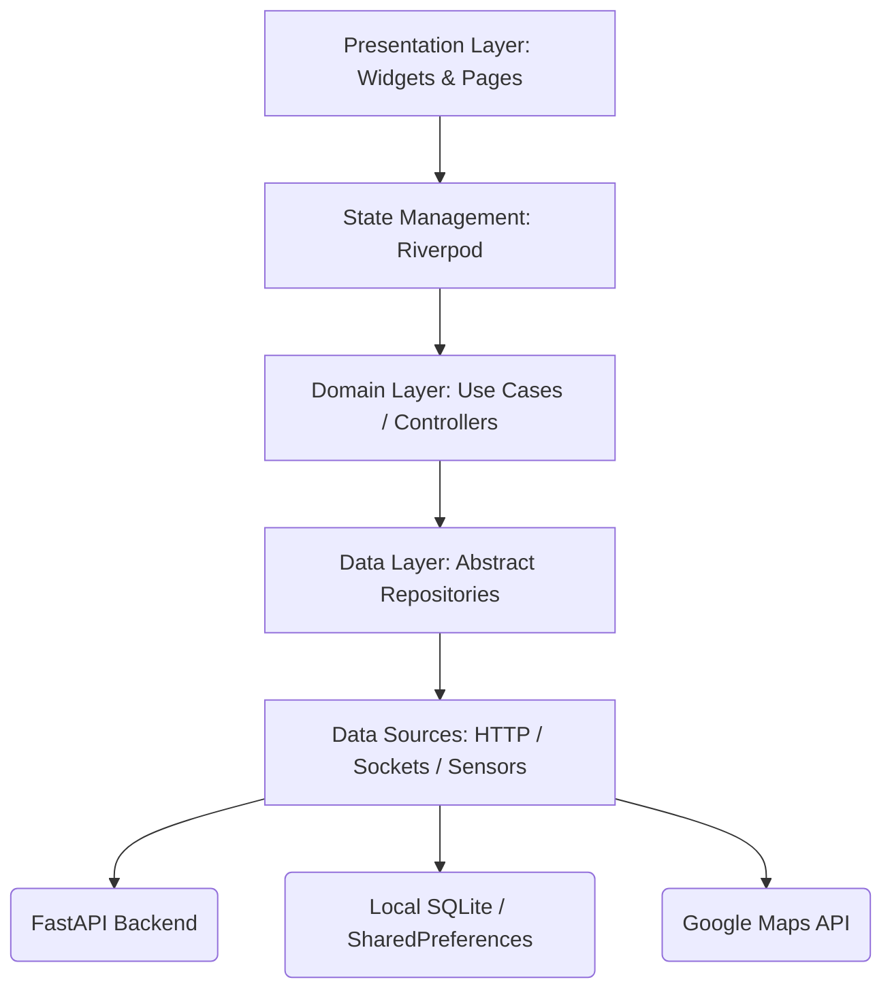

# Mobile Architecture Specification: SmartAid (Deccan-Aid)

## Introduction
The SmartAid Flutter application is the primary interface for citizens, ambulance drivers, and hospital administrators during life-or-death emergencies. The overarching goal of this mobile architecture is to guarantee absolute reliability under extreme duress. 

To achieve this, the architecture focuses on:
*   **Scalability:** A modular structure allowing multiple engineering teams to work on discrete features simultaneously.
*   **Maintainability:** Strictly decoupling UI, business logic, and data sources to make the codebase self-documenting and easy to refactor.
*   **Testability:** Dependency injection and pure Dart business layers ensure that 100% of core emergency pathways can be unit tested without a physical device.
*   **Performance:** Minimizing widget rebuilds and isolating heavy sensor-polling loops to background isolates to preserve fluid 60FPS UI rendering.
*   **Security:** Enforcing strict OS-level protections over location telemetry and Firebase auth tokens.

---

## Architectural Principles
We employ a synthesis of **Clean Architecture** and **Feature-First Organization**.

*   **Clean Architecture:** We isolate the domain layer (business rules) from the data layer (MongoDB/FastAPI) and the presentation layer (Flutter Widgets). This ensures that if the backend swaps from REST to gRPC, the UI layer remains untouched.
*   **Feature-First Architecture:** Instead of grouping files by type (e.g., placing all models in one folder), we group by feature (e.g., `features/emergency/`). This prevents module coupling and allows seamless scaling.
*   **Separation of Concerns:** UI widgets only paint pixels; they never parse JSON or instantiate WebSockets.
*   **Dependency Inversion:** High-level policy modules (Dispatch Logic) do not depend on low-level detail modules (HTTP Clients). Both depend on abstract interfaces.
*   **Reusability:** Common components (buttons, map widgets, JWT interceptors) are localized into `core/` and `shared/` directories.

---

## High-Level Mobile Architecture



---

## Flutter Project Structure

The codebase is organized utilizing a strict feature-driven approach:

```text
frontend/
└── lib/
    ├── core/          # Foundational, app-wide configurations
    ├── shared/        # Reusable UI widgets and models
    ├── features/      # Independent business modules
    ├── services/      # External integrations (Firebase, Sockets)
    ├── routes/        # GoRouter navigation configurations
    ├── config/        # Environment variables and API keys
    └── main.dart      # Application entry point & DI Root
```

---

## Core Layer

The `core/` directory houses the non-business scaffolding that allows the app to function:
*   `core/constants/`: Enums, string keys, and API path definitions.
*   `core/exceptions/`: Custom network and domain error classes (e.g., `EmergencyTimeoutException`).
*   `core/network/`: Base HTTP clients (Dio) configured with global interceptors.
*   `core/storage/`: Wrappers for `flutter_secure_storage`.
*   `core/utilities/`: Pure Dart helper functions (date formatters, validators).
*   `core/themes/`: Material 3 `ThemeData` definitions.

---

## Feature Modules

Each folder within `features/` operates almost as an independent Flutter package.

### authentication/
*   **Responsibilities:** Firebase token management, session handling, login/registration.
*   **Screens:** LoginScreen, RegisterScreen, OTPVerificationScreen.
*   **Services:** `AuthRepository`, `FirebaseAuthService`.
*   **State:** `AuthProvider`.

### emergency/
*   **Responsibilities:** SOS triggering, AI crash detection ingestion, panic state UI.
*   **Screens:** SOSDashboard, CountdownScreen, PostSOSInstructionScreen.
*   **Services:** `EmergencyRepository`, `DeviceSensorService`.
*   **State:** `EmergencyStateNotifier`.

### tracking/
*   **Responsibilities:** Map rendering and polyline route mapping.
*   **Screens:** LiveTrackingMapScreen.
*   **Services:** `GeoLocationService`, `WebSocketTrackingRepo`.
*   **State:** `TrackingCoordinatesProvider`.

### driver/
*   **Responsibilities:** Fleet assignment queues, assessment forms.
*   **Screens:** IncidentQueueScreen, AcceptDenyModal, MedicalAssessmentForm.
*   **Services:** `DispatchRepository`.
*   **State:** `DriverAvailabilityNotifier`.

### hospital/
*   **Responsibilities:** Dashboard tables, bed capacity input.
*   **Screens:** InboundPatientTable, CapacityManagerScreen.
*   **Services:** `HospitalAdminRepository`.
*   **State:** `CapacityState`.

---

## User Role Architecture

The application intelligently morphs its UI tree instantly upon login based on the JWT role:

*   **Citizen:** Given access directly to the `emergency/` feature. Map controls are restricted to viewing only. 
*   **Driver:** Launched directly into the `driver/` queue. Map features unlock editing capabilities (submitting location). Background location permissions become aggressively mandatory.
*   **Hospital Admin:** Mobile usage usually discouraged in favor of tablet/web view. Interfaces focus on dense tabular data and accept/reject swiping gestures.

---

## State Management Architecture

State Management is enforced using **Riverpod**, ensuring compile-time safety and dependency injection abstraction.

*   **Global State:** Read-only configurations (e.g., `EnvironmentProvider`).
*   **Session State:** Cross-feature contexts (e.g., `AuthenticatedUserProvider`).
*   **Feature State:** Scoped logic (e.g., `IsActiveEmergencySOSProvider`).
*   **Local UI State:** Ephemeral visual state (e.g., `StatefulWidget` toggle arrays) managing animations or text field focus.


---

## Navigation Architecture

Navigation routing is uniformly orchestrated utilizing the declarative `go_router` package.

*   **Splash Flow:** Evaluates `flutter_secure_storage` for token. If valid, fetches user role.
*   **Authentication Flow:** Pushes to `/login` if no valid session is found.
*   **Role-Based Forks:** 
    * `/citizen/home`
    * `/driver/dashboard`
    * `/hospital/queue`
*   **Navigation Guards:** Riverpod intercepts route transitions. For example, if a token expires natively, the app triggers a `ref.invalidate(sessionProvider)`, automatically ejecting the user to `Splash Flow`.

---

## Network Layer Architecture

The connectivity pipeline is robustified against cellular volatility:
*   **API Client:** Built atop `Dio`.
*   **Interceptors:** Auto-inject `Authorization: Bearer <token>` into every request header.
*   **Retry Logic:** `dio_retry` package implements exponential backoff on 5xx and 429 server errors.
*   **Timeout Handling:** SOS packets feature reduced 3-second network timeouts to fallback to SMS or alternative connections instantly rather than waiting 30 seconds for a failed HTTP socket.

---

## Real-Time Communication Architecture

While HTTP is used for CRUD, Socket.IO manages high-frequency spatial parity.

*   **Connection Lifecycle:** Singleton instance instantiated post-login. Destroyed upon app termination or logout.
*   **Event Handling:** Stream Controllers consume raw socket strings, convert them into Dart Pydantic-equivalent models, and push updates to Riverpod states.
*   **Background Sync:** If the app is minimized, the OS background runner maintains the socket connection exclusively for drivers mapping locations. 

---

## Local Storage Architecture

*   **Secure Storage:** `flutter_secure_storage` (AES encryption) is strictly restricted to JWTs and Refresh Tokens.
*   **Shared Preferences:** Caching user preferences like "Dark Mode" and temporary location permission flags.

---

## Maps Architecture

Given heavy reliance on Google Maps:
*   **Integration:** Utilizing the official `google_maps_flutter` package.
*   **Marker Management:** Markers are tightly bound to Riverpod streams. If the driver coordinate stream updates, the provider rebuilds only the `Set<Marker>`, forcing the map engine to mathematically interpolate the vehicle's movement rather than stuttering.

---

## AI Integration Architecture

*   **Gemini Requests:** Encapsulated in the `ai/` feature layer.
*   **Fallback Strategy:** Due to potentially variable response times from LLMs, UI components wrap AI queries in "Thinking..." shimmer effects. If an assessment exceeds 4 seconds, the app defaults to strict local-device mathematical severity protocols to guarantee dispatch logic isn't hampered by cloud lag.

---

## Notification Architecture

*   **Push Notifications:** Firebase Cloud Messaging (FCM) handles alerting offline drivers or distant family members.
*   **In-App Alerts:** Handled by a global `ScaffoldMessenger` wrapper, visually interrupting the user flow with red-branded overlays when high-priority sockets are consumed.

---

## UI Architecture

*   **Design System:** Built upon Material 3 principles with heavy customization to ensure massive font legibility and high contrast during chaotic situations.
*   **Components:** Buttons, especially the central SOS trigger, utilize massive tap-targets adhering to extreme accessibility tolerances.
*   **Responsive Design:** Using `LayoutBuilder`, grid logic detects generic tablet dimensions, adapting Hospital Administrator tables to two-pane configurations rather than overflowing mobile phone scrolling.

---

## Security Architecture

*   **Token Security:** JWTs never touch plaintext `SharedPreferences`.
*   **Medical Data Protection:** Any PHI cached locally is stored inside the secure encrypted keystore bounding.
*   **Location Privacy:** Explicit granular permissions are checked before instantiating the geolocation tracking hooks, maintaining GDPR compliance.

---

## Performance Architecture

*   **Memory Management:** Strictly releasing `StreamSubscriptions` and `Socket.io` hooks within widget `dispose()` methods.
*   **App Startup:** Avoiding expensive async `SharedPreferences` hydration calls during the `main()` execution thread preventing layout blocking.
*   **Battery Optimization:** Limiting background tracking streams solely to assigned driver roles; citizen applications hibernate completely upon minimization.

---

## Testing Strategy

*   **Unit Testing:** 100% code coverage on `core/network/` parsers and AI logic response formats.
*   **Widget Testing:** Ensuring the SOS button triggers state changes.
*   **Integration Testing:** Bootstrapping `integration_test` to drive simulated Android instances clicking through the login-to-dispatch flow to verify network chains completely end-to-end.

---

## Future Expansion

1.  **Wearables:** Creating a companion `flutter_wear_os` interface allowing instant SOS pushes from external Apple/Android watches.
2.  **Smart Ambulance Displays:** Implementing Android Automotive generic views allowing the driver application to mirror onto large fleet-vehicle console screens.

---

## Conclusion
The SmartAid Flutter architecture transforms a chaotic physical environment into organized, predictable digital workflows. By strictly adhering to a Riverpod-driven, Feature-First Clean Architecture, the mobile codebase is resilient to network failures, performs elegantly under mapping constraints, and is perfectly positioned for endless enterprise scaling.
