# System Workflows: SmartAid (Deccan-Aid) Emergency Response Platform

## Introduction
Workflow modeling defines the sequential and parallel business processes required to deliver a service. In the context of SmartAid, workflow modeling abstracts complex technology into pure operational choreography. Every second saved in a workflow translates directly to saved lives. These models ensure that regardless of the software architecture, the business rules governing citizen safety, hospital capacity, and driver logistics are executed flawlessly.

## Workflow Overview
The SmartAid platform functions as an orchestration layer connecting decentralized entities. 

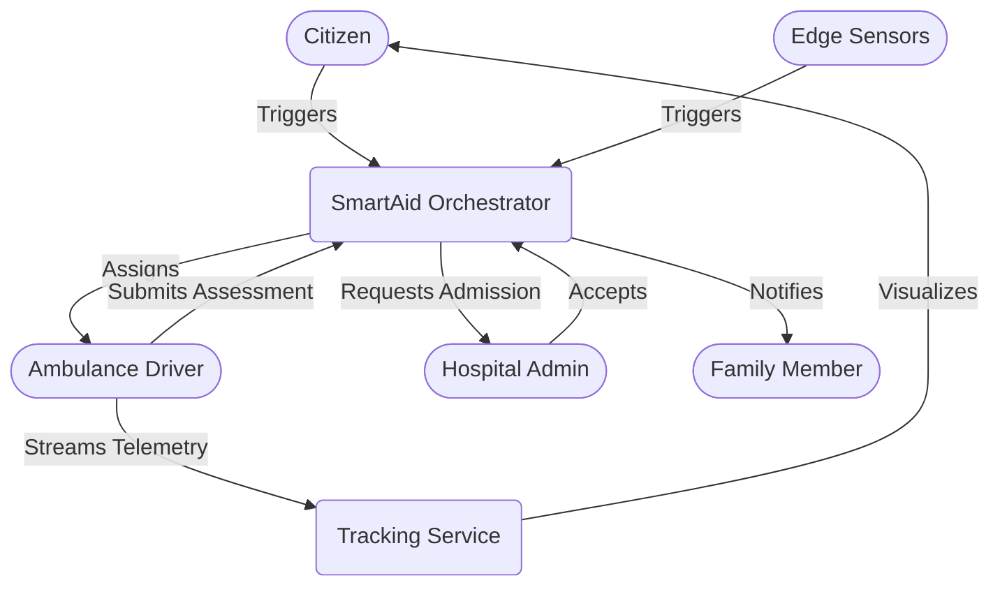

---

## Workflow 1: Manual SOS Activation

**Scenario:** A citizen manually requests emergency assistance using the panic button.

*   **Trigger Conditions:** Citizen opens application and triggers SOS.
*   **Participants:** Citizen, Coordination System.
*   **Inputs:** GPS Coordinates, User Medical Profile.
*   **Outputs:** Active Emergency Request, Dispatch Command.
*   **Success Conditions:** Emergency Request validated and entered into dispatch queue.
*   **Failure Conditions:** Lack of GPS signal resulting in geographic ambiguity.

### Sequence Diagram
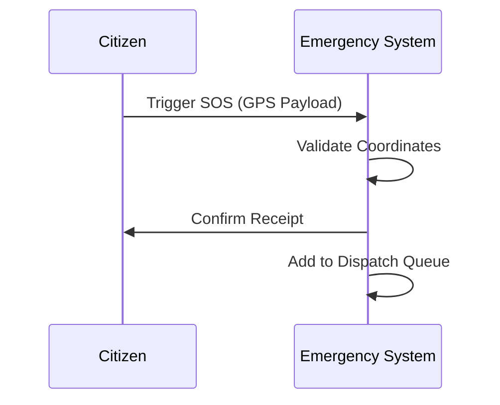

### Activity Diagram
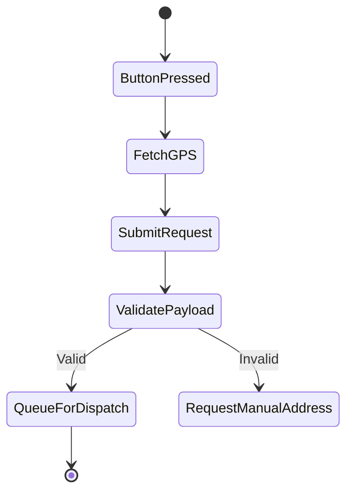

### Swimlane Diagram
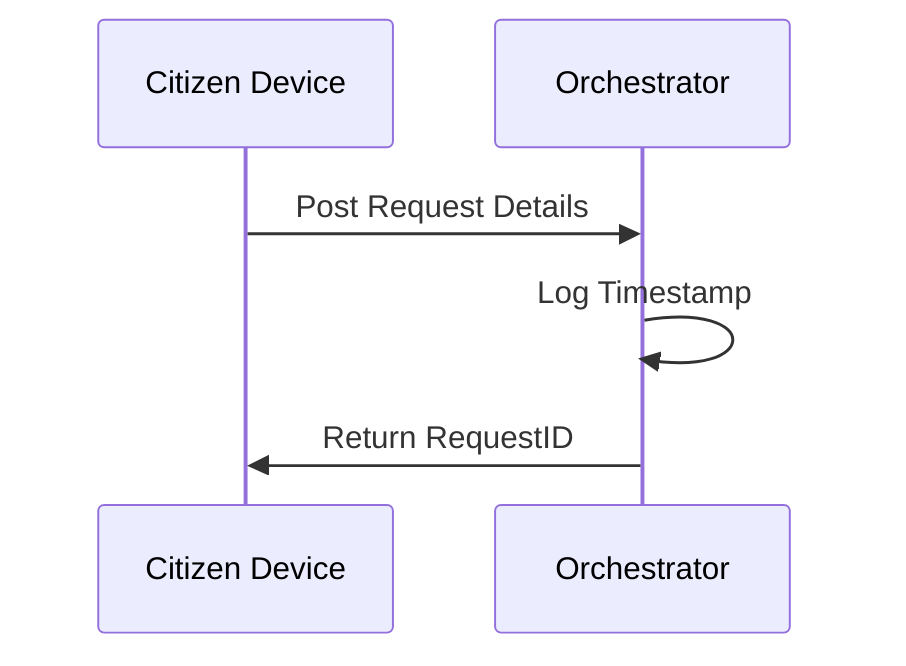

---

## Workflow 2: Automatic Accident Detection

**Scenario:** Mobile sensors detect a potential accident (high g-force impact).

*   **Sensor Monitoring:** Polling accelerometer/gyro at 100ms ticks.
*   **Event Detection:** Values exceed hardware crash thresholds.
*   **Severity Assessment:** Calculations map to High/Medium thresholds.
*   **Auto SOS Creation:** SOS packet generated without user UI interaction.
*   **Emergency Validation:** System initiates 5-second waiting period to allow citizen to cancel a false positive.
*   **Dispatch Initiation:** If not cancelled, proceeds to dispatch queue.

### Event Flow Diagram
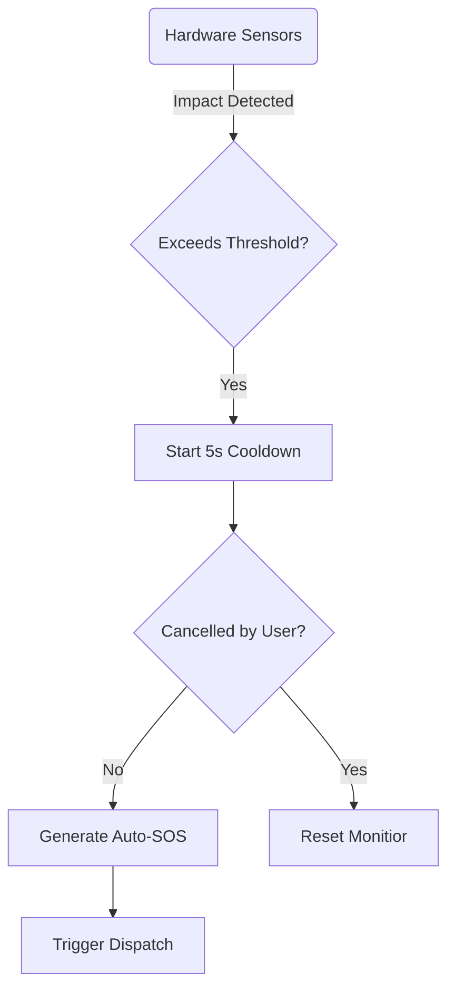

---

## Workflow 3: Emergency Assessment Workflow

**Scenario:** The system determines how fast an ambulance must travel.

*   **Emergency Classification:** Parsing the origin of the event (Auto vs Manual).
*   **Severity Determination:** Auto-events classified as High; Manual requires AI chat classification.
*   **Priority Assignment:**
    *   **High Priority:** Lights and sirens authorized; bypasses all queues.
    *   **Medium Priority:** Standard medical transport route.
    *   **Low Priority:** Delayed transport allowed if fleet is busy.

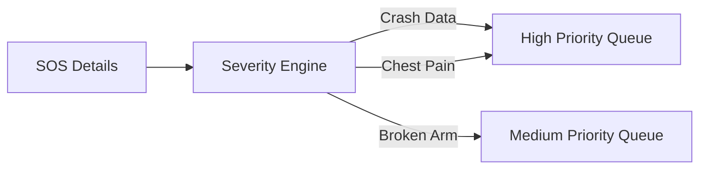

---

## Workflow 4: Ambulance Discovery Workflow

**Scenario:** The system finds the closest physical unit.

*   **Availability Checks:** Filter driver database for `status: 'Available'`.
*   **Distance Evaluation:** Issue geospatial polygon query around incident.
*   **Candidate Ranking:** Rank available units by drive-time ETA using traffic topology.

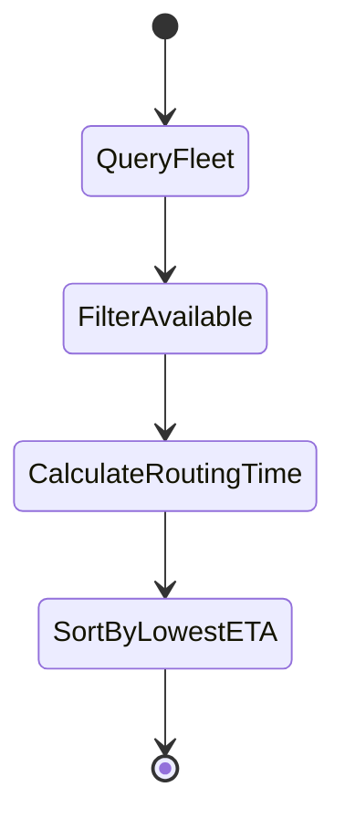

---

## Workflow 5: Ambulance Assignment Workflow

**Scenario:** Orchestrating the "booking" of a specific ambulance.

*   **Assignment Creation:** Lock the top-ranked ambulance.
*   **Driver Notification:** App alarm triggers on driver's console.
*   **Acceptance:** Driver acknowledges; tracking initiates.
*   **Rejection:** Driver hits reject; system loops back to Workflow 4 for next candidate.
*   **Reassignment Process:** Triggered automatically if driver fails to respond within 30 seconds.

### Sequence Diagram
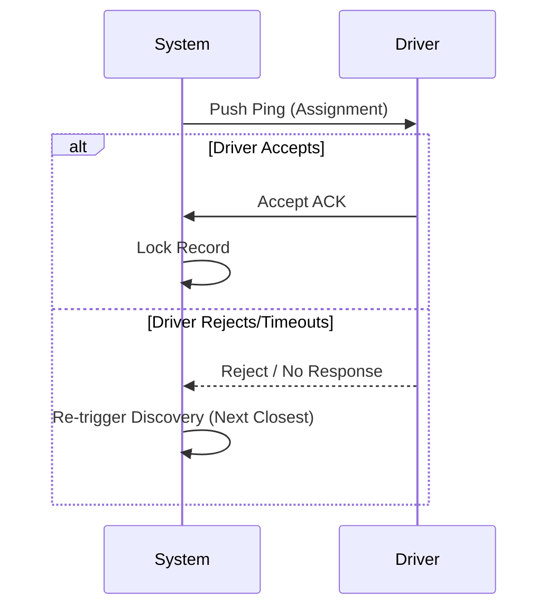

---

## Workflow 6: Ambulance Navigation Workflow

**Scenario:** The driver navigating safely to the crisis.

*   **Route Generation:** Mapping polyline to the exact GPS node.
*   **Route Updates:** Dynamic rerouting if congestion occurs.
*   **ETA Calculations:** Continuous recalibrated calculations.
*   **Traffic Adjustments:** Historical data used to project arrival time.

---

## Workflow 7: Real-Time Tracking Workflow

**Scenario:** Creating transparency via mapping arrays.

*   **Location Updates:** Driver's OS reads GPS.
*   **Position Broadcasting:** Packet fired to System every 3-5 seconds.
*   **User Notifications:** Citizen map icon translates smoothly via delta positions.

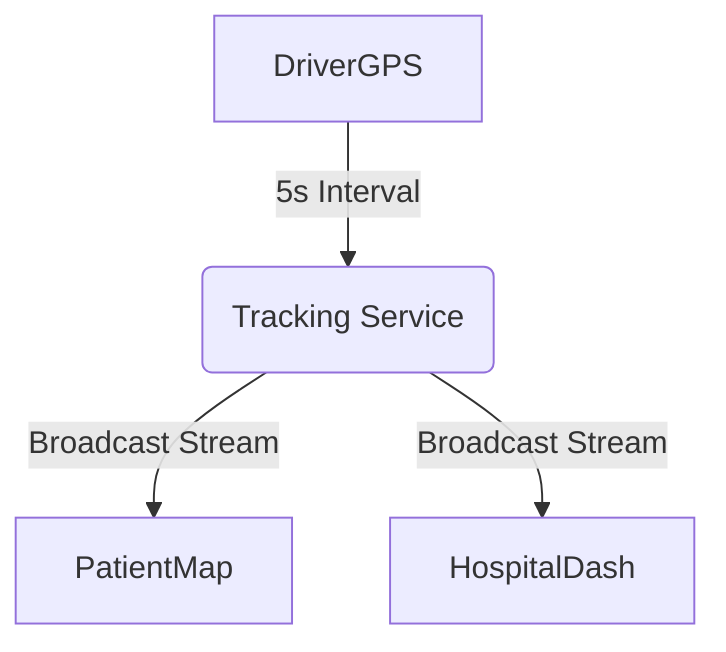

---

## Workflow 8: Hospital Recommendation Workflow

**Scenario:** Picking the correct endpoint facility.

*   **Nearby Discovery:** Query hospitals within 15km of the emergency scene.
*   **Capacity Verification:** Filter out hospitals returning `capacity = 0`.
*   **Specialty Matching:** If head trauma, filter for Neuro-Trauma capable hospitals.
*   **Recommendation Generation:** Provide driver top 3 choices.

---

## Workflow 9: Hospital Admission Workflow

**Scenario:** Ensuring a bed is ready.

*   **Admission Request:** Driver pushes "Request Transfer" to Hospital X.
*   **Capacity Review:** ER Admin dashboard receives assessment payload.
*   **Acceptance:** Admin approves; driver gets go-ahead.
*   **Rejection:** Admin rejects; system auto-defaults to Recommendation #2.

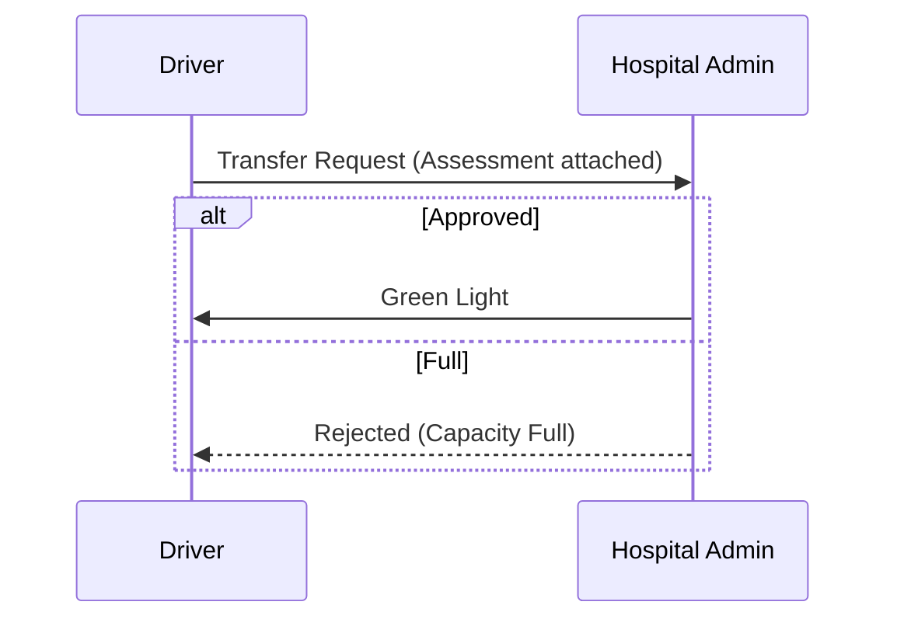

---

## Workflow 10: Family Notification Workflow

**Scenario:** Keeping trusted contacts informed.

*   **Emergency Confirmation:** SMS sent to stored contacts ("User has initiated SOS").
*   **Updates:** Live share link generated for tracking ambulance.
*   **Arrival Notifications:** "Patient has arrived at Hospital X."

---

## Workflow 11: Emergency Closure Workflow

**Scenario:** Terminating the lifecycle.

*   **Successful Admission:** Physical handover signed electronically via app.
*   **Case Completion:** Request transitions to `Closed`.
*   **Data Archival:** Analytics recorded (total response time).
*   **Metrics:** Driver metric points awarded.

---

## Exception Handling Workflows

### No Ambulance Available
*   **Detection:** Fleet query returns empty set.
*   **Mitigation:** Escalate via API to municipal 911 dispatch.
*   **Recovery:** Keep pinging system every 30 seconds while alerting user of delay.

### Driver Rejects Request
*   **Detection:** Decline payload received.
*   **Mitigation:** Immediately assign to rank #2 candidate in proximity array.

### Driver Becomes Unreachable
*   **Detection:** Tracking session misses 6 consecutive pings.
*   **Mitigation:** Assume vehicle failure/crash. Dispatch second ambulance automatically.

### Hospital Rejects Admission
*   **Detection:** Denial payload received.
*   **Mitigation:** Alert driver via UI overlay and provide routing to alternative hospital.

### GPS Failure
*   **Detection:** Device reports extreme margin of error (>5000m).
*   **Mitigation:** Fallback to cell-tower triangulation or prompt user for landmark entry.

---

## State Transition Models

### Emergency Request States
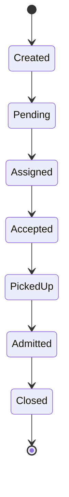

### Ambulance States
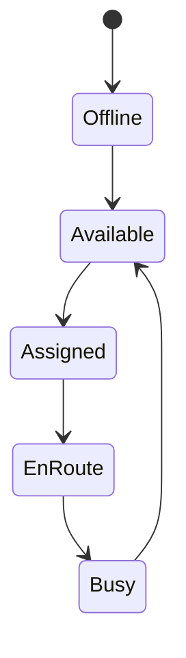

### Hospital Admission States
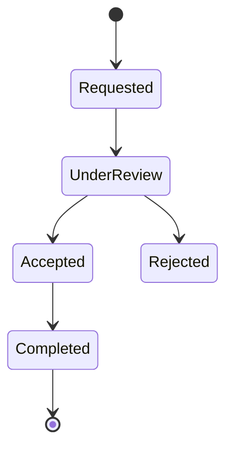

---

## Performance Requirements

Workflow efficiency targets (KPIs):
*   **Maximum Dispatch Time:** 5 seconds (SOS Creation to Assignment creation).
*   **Assignment Confirmation Time:** 15 seconds (Driver reaction allowance).
*   **Tracking Latency:** <250ms (Driver position update to Patient screen rendering).
*   **Admission Confirmation Time:** <60 seconds (Hospital Admin review time).

---

## Future Workflow Enhancements

*   **Predictive Dispatching:** Repositioning idle ambulances based on machine learning probability models of accident zones.
*   **Traffic Signal Integration:** Sending webhooks to municipal traffic controllers to trigger green waves based on active routing paths.
*   **Drone-Assisted Response:** First-responder drones delivering defibrillators ahead of physical ambulances.
*   **Telemedicine Workflows:** Integrating live video feeds into the Hospital Review workflow.

---

## Conclusion
The SmartAid workflow architecture defines an airtight, real-time logistics engine. By mapping every single process—from the initial auto-detected crash to the final hospital handover—into structured flow paths, the system ensures zero ambiguity during high-stress crises. Rigorous exception handling guarantees that single points of failure (unavailable drivers, full hospitals, dropping GPS) are mitigated instantly by secondary automated workflows, culminating in an orchestration layer built entirely around maximizing survival rates.
