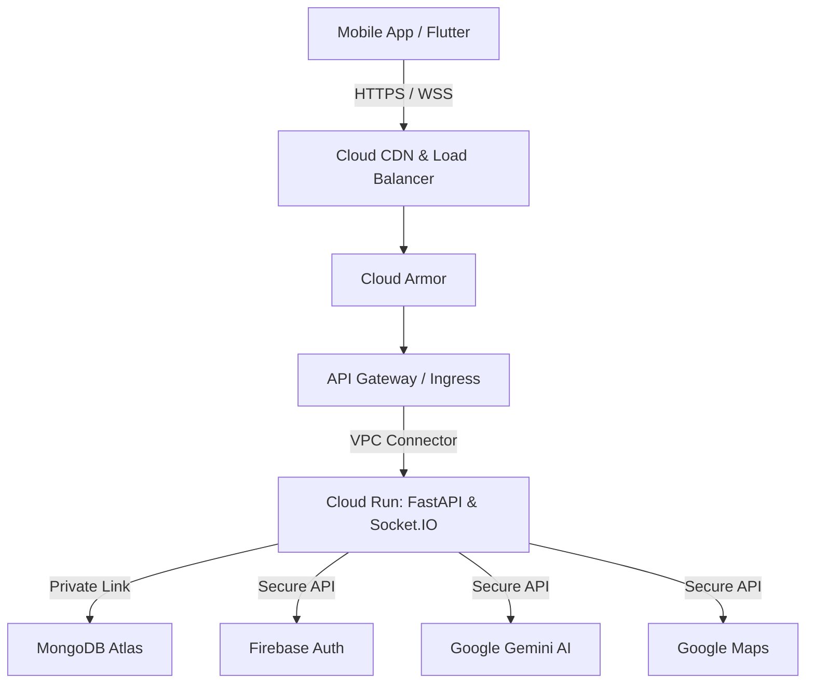
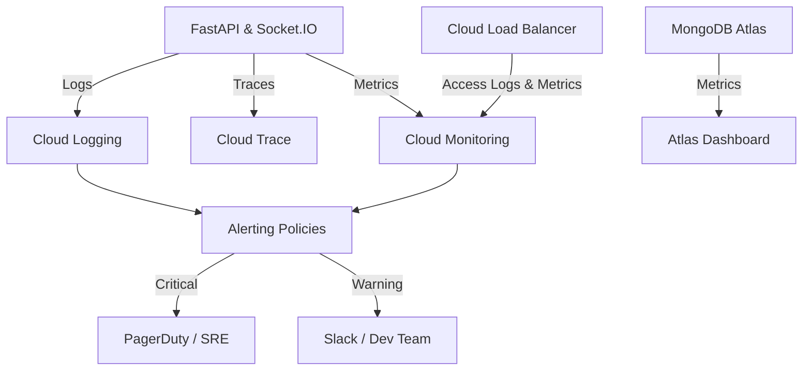

# SmartAid Deployment Architecture

## 1. Deployment Goals
The primary goal of the SmartAid infrastructure is to ensure a highly available, secure, and scalable emergency response ecosystem. Key objectives include:
- **Zero Downtime**: Ensuring emergency services are accessible 24/7.
- **Low Latency**: Minimizing response times for real-time tracking and SOS requests.
- **Scalability**: Ability to handle sudden spikes in traffic during major emergencies.
- **Security & Compliance**: Securing patient data and complying with healthcare regulations.
- **Resilience**: Implementing robust disaster recovery and automatic failover mechanisms.

## 2. Infrastructure Overview
SmartAid employs a modern, cloud-native architecture deployed on Google Cloud Platform (GCP). The system utilizes a microservices approach with a Flutter mobile frontend communicating via FastAPI backend services, managed and orchestrated through Google Cloud Run for serverless scaling.

## 3. High-Level Topology
The deployment topology is segregated into distinct layers to enforce security and manageability:
- **Presentation Layer**: Flutter mobile applications for users and responders.
- **Edge Layer**: Cloud Load Balancing and API Gateway handling ingress traffic, SSL termination, and basic DDoS protection.
- **Application Layer**: Containerized FastAPI microservices deployed on Cloud Run, handling business logic and real-time Socket.IO communication.
- **Data Layer**: MongoDB Atlas for persistent storage and Firebase Authentication for identity management.
- **AI & Integration Layer**: Google Gemini for AI-driven insights and Google Maps Platform for geolocation services.

## 4. Cloud Components (Google Cloud Services)
- **Cloud Run**: Hosts the FastAPI backend and Socket.IO servers.
- **Cloud Load Balancing**: Distributes incoming traffic globally.
- **Cloud Armor**: Provides web application firewall (WAF) and DDoS protection.
- **Secret Manager**: Securely stores API keys, database credentials, and service account keys.
- **Cloud Storage**: Stores static assets and user-uploaded media.
- **VPC Serverless Access**: Enables secure, private communication between Cloud Run and other internal services.

## 5. Network Architecture
The network is designed around a zero-trust model.



### Trust Boundaries
- **Public Zone**: Client devices to Load Balancer. All data is encrypted via TLS 1.3.
- **DMZ Zone**: Load Balancer to Cloud Run instances. Protected by Cloud Armor policies.
- **Private Zone**: Cloud Run to MongoDB Atlas (via VPC Peering/PrivateLink). No internet access allowed directly to the database.

---

## 6. Containerization Strategy & Docker Architecture
SmartAid relies on Docker for containerizing the FastAPI and Socket.IO microservices.
- **Base Image**: Lightweight `python:3.11-slim` to minimize the attack surface.
- **Multi-Stage Builds**: Used to separate build dependencies from runtime dependencies, optimizing image size and security.
- **Stateless Architecture**: Containers do not store any local state. All state is externalized to MongoDB Atlas or managed via Socket.IO Redis adapters (if scaled).

## 7. Environment Strategy
SmartAid maintains strict environment separation to ensure code stability from development to production.

- **Development**: Local environment utilizing Docker Compose. Connects to a local MongoDB instance or a dedicated dev-cloud database.
- **Staging**: A mirror of the production environment. Used for QA, integration testing, and client sign-off. Deployed to a separate GCP project to enforce absolute isolation.
- **Production**: The live environment serving real SOS requests, ambulance tracking, and hospital coordination.

## 8. Configuration Management
Environment-specific configurations are managed via `.env` files. Configuration inheritance is used where possible, with specific overrides per environment.

### `.env.development`
```env
ENVIRONMENT=development
DEBUG=True
DATABASE_URI=mongodb://localhost:27017/smartaid_dev
FIREBASE_PROJECT_ID=smartaid-dev-project
CORS_ORIGINS=http://localhost:3000,*
LOG_LEVEL=DEBUG
```

### `.env.staging`
```env
ENVIRONMENT=staging
DEBUG=False
DATABASE_URI=${SECRET_MANAGER_MONGO_STAGING_URI}
FIREBASE_PROJECT_ID=smartaid-staging-project
CORS_ORIGINS=https://staging.smartaid.com
LOG_LEVEL=INFO
```

### `.env.production`
```env
ENVIRONMENT=production
DEBUG=False
DATABASE_URI=${SECRET_MANAGER_MONGO_PROD_URI}
FIREBASE_PROJECT_ID=smartaid-prod-project
CORS_ORIGINS=https://app.smartaid.com,https://admin.smartaid.com
LOG_LEVEL=WARNING
```

## 9. Secrets Management
Hardcoding secrets is strictly prohibited.
- **Google Secret Manager**: The central vault for all sensitive data (e.g., `DATABASE_URI`, `GEMINI_API_KEY`, `FIREBASE_SERVICE_ACCOUNT`).
- **Runtime Injection**: Cloud Run automatically injects secrets from Secret Manager as environment variables at runtime.
- **Secret Rotation Strategy**: 
  - API keys and service accounts are automatically rotated every 90 days.
  - Emergency manual rotation playbooks are defined for suspected compromises.

---

## 10. CI/CD Architecture & GitHub Actions
SmartAid utilizes GitHub Actions for continuous integration and continuous deployment, ensuring that code moves reliably from development to production.

### Workflow Design
1. **Feature Branches (`feature/*`, `bugfix/*`)**:
   - Trigger: Push to branch.
   - Action: Linting, Unit Tests, Static Code Analysis (SonarQube).
   - Gate: Must pass all tests to allow PR creation.

2. **Develop Branch (`develop`)**:
   - Trigger: Merge PR from Feature Branch.
   - Action: Full test suite, Build Docker Image, Push to Google Artifact Registry, Deploy to Staging Environment.
   - Gate: End-to-end tests run against Staging.

3. **Main Branch (`main`)**:
   - Trigger: Merge PR from Develop.
   - Action: Pre-release checks. Prepares release candidate.

4. **Production Releases (Tags `v*.*.*`)**:
   - Trigger: Creation of a semantic version tag (e.g., `v1.2.0`).
   - Action: Build Production Docker Image, Push to Google Artifact Registry, Deploy to Production Cloud Run (Blue/Green Deployment).
   - Gate: Requires manual approval from DevOps/Lead Engineer in GitHub Actions before executing production deploy.

## 11. Pipeline Diagrams

```mermaid
graph LR
    Dev[Developer Push] -->|Feature Branch| CI[GitHub Actions CI]
    CI -->|Lint & Test| PR[Pull Request Validation]
    PR -->|Merge| DevBranch[Develop Branch]
    DevBranch --> BuildStaging[Build & Push Image]
    BuildStaging --> DeployStaging[Deploy to Staging]
    DeployStaging --> E2E[E2E Tests]
    E2E -->|Approve PR| MainBranch[Main Branch]
    MainBranch -->|Tag v*.*.*| BuildProd[Build & Push Prod Image]
    BuildProd --> DeployProd[Deploy to Production]
```



## 12. Release Strategy
SmartAid uses a **Blue/Green Deployment** strategy on Cloud Run via traffic splitting:
- A new revision (Green) is deployed with 0% traffic.
- Health checks are verified against the Green revision.
- Traffic is incrementally shifted (e.g., 10% -> 50% -> 100%) to the new revision.
- If errors spike, traffic is immediately routed back to the old revision (Blue).

## 13. Rollback Process
- **Automated Rollback**: If the new deployment fails health checks or error rates exceed 2% within the first 5 minutes of traffic shifting, Cloud Run automatically reverts 100% traffic to the previous stable revision.
- **Manual Rollback**: A GitHub Action `Rollback Deploy` workflow can be triggered manually to immediately restore the last known good container image and configuration.

---

## 14. Monitoring & Observability Architecture
Given the life-critical nature of the SmartAid ecosystem, comprehensive monitoring, logging, and tracing are integrated across all layers.

### Logging Architecture
- **Cloud Logging (Stackdriver)**: All backend logs, container stdout/stderr, and HTTP access logs are ingested here.
- **Structured Logging**: The FastAPI application uses JSON-formatted structured logging, embedding Trace IDs to stitch together requests across services.

### Observability & Distributed Tracing
- **Cloud Trace**: Captures the latency of all internal requests (e.g., FastAPI calling MongoDB or Gemini AI).
- **Correlation IDs**: A unique `X-Request-ID` is generated at the Cloud Load Balancer and propagated through the API Gateway to the backend to trace the full lifecycle of a user action.

## 15. Metrics & Telemetry
Various components are monitored for key performance indicators (KPIs).

- **Application Monitoring**:
  - Request volume (RPS), error rates (HTTP 4xx/5xx), and API latency.
  - Tracked via Google Cloud Monitoring.
- **Database Monitoring (MongoDB Atlas)**:
  - Connection pooling limits, IOPS, CPU utilization, and slow queries.
- **Realtime Service Monitoring (Socket.IO)**:
  - Active WebSocket connections, message broadcast latency, and disconnect rates.
- **AI Service Monitoring**:
  - Token consumption limits, Gemini API latency, and failure rates.

## 16. Health Checks & Incident Detection
- **Liveness Probes**: `/health/live` endpoint ensures the FastAPI container is running. If failed, Cloud Run automatically kills and restarts the container.
- **Readiness Probes**: `/health/ready` checks connections to MongoDB, Firebase, and Redis. Prevents traffic routing until the service is fully ready.

## 17. Alerting Strategy
Alerting is threshold-based and integrated with incident management tools (e.g., PagerDuty, Slack).
- **Critical Alerts (P1)**: 
  - API Error Rate > 2% for 5 minutes.
  - Database Connection Failure.
  - SOS Socket Disconnect Spikes.
  - **Action**: Pages on-call Site Reliability Engineer (SRE).
- **Warning Alerts (P2)**: 
  - API Latency > 500ms (p95).
  - High container CPU usage.
  - **Action**: Slack notification to the engineering team.

### Monitoring Architecture Diagram

