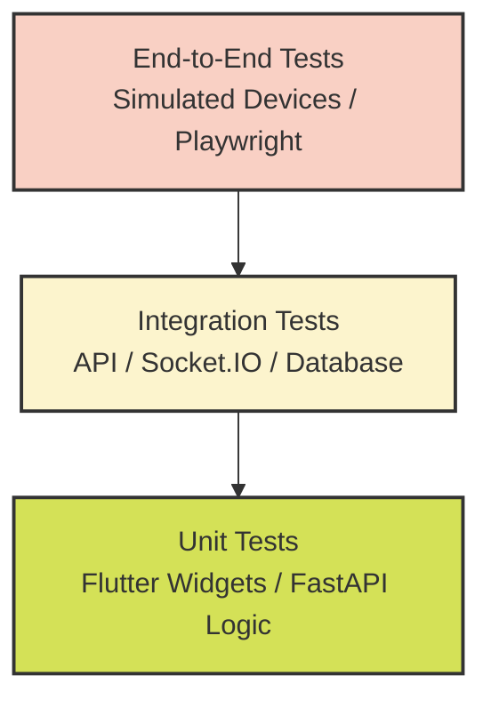

# SmartAid Testing & Quality Assurance Strategy

## 1. Testing Vision
As an AI-powered emergency ambulance response ecosystem, SmartAid operates in a life-critical domain where system failures can have severe consequences. Our testing vision is to ensure **zero-defect critical paths**, absolute system reliability during emergency spikes, and strict data integrity across all user journeys (Citizens, Drivers, Hospitals, and Administrators).

### Why Testing Matters in Emergency Systems
In emergency response, seconds matter. A delayed Socket.IO event, a miscalculated Google Maps route, or a failed Firebase authentication attempt can directly impact patient outcomes. Quality Assurance in SmartAid is not merely about finding bugs; it is about guaranteeing operational safety and resilience under extreme conditions.

## 2. Quality Objectives & KPIs
Our testing strategy is designed to achieve the following Quality Key Performance Indicators (KPIs):
- **100% Reliability on Critical Workflows**: e.g., SOS creation, automatic accident detection, and ambulance assignment.
- **< 500ms API Latency**: For 95% of critical backend requests.
- **Zero Data Loss**: In MongoDB transactions and Socket.IO real-time events.
- **> 85% Code Coverage**: For backend FastAPI services and Flutter UI logic.
- **Automated Regression**: 100% of P1 bugs must have corresponding automated regression tests.

## 3. Testing Principles
- **Risk-Based Testing**: Prioritize testing efforts based on the potential impact of failure. Emergency flows receive significantly more testing rigor than administrative features.
- **Shift-Left**: Integrate testing early in the development lifecycle via PR validation, automated linting, and static code analysis.
- **Automation First**: Manual testing is reserved exclusively for exploratory testing, usability assessments, and complex edge cases that cannot be easily mocked.

## 4. Test Pyramid Strategy
SmartAid follows a modernized test pyramid, adapted for AI and Realtime capabilities.

- **Base (Unit Tests)**: High volume, fast execution. Validates individual functions, Flutter widgets, and FastAPI route handlers.
- **Middle (Integration Tests)**: Validates communication between components. Crucial for verifying FastAPI to MongoDB, Socket.IO event broadcasting, and Google Gemini prompt parsing.
- **Top (End-to-End)**: Low volume, high value. Simulates complete user journeys (e.g., Citizen creating an SOS and Driver accepting the request) in a production-like environment.

---

## 5. Unit & Integration Testing Framework

Our foundational testing layers are designed for high speed and extensive coverage, ensuring business logic correctness before code merges.

### Target Coverage Metrics
| Component | Minimum Coverage Target | Primary Tooling |
| :--- | :--- | :--- |
| **FastAPI Backend (Logic/Services)** | 85% | `pytest`, `pytest-cov`, `pytest-asyncio` |
| **Flutter Mobile App (Widgets/Blocs)** | 80% | `flutter test`, `bloc_test`, `mockito` |
| **Data Models / Repositories** | 90% | `pytest` (Backend), `flutter test` (Frontend) |

### 6. Flutter Unit & Widget Testing
- **State Management (Bloc/Riverpod)**: Isolated unit tests verify state transitions triggered by UI events or background tasks (e.g., verifying `AmbulanceAssignedState` emits when a Socket.IO assignment event is received).
- **Widget Testing**: Flutter's `WidgetTester` is used to instantiate UI components in a headless environment. 
  - Validates correct rendering of Maps, SOS buttons, and emergency notification modals.
  - Ensures responsive design constraints are met.
- **Mocking Strategy**: `mockito` is heavily utilized to mock network calls, Firebase dependencies, and platform channels (e.g., GPS location hardware).

### 7. FastAPI Service & Repository Testing
- **Service Layer**: Business logic (e.g., matching the nearest ambulance via geospatial queries) is tested in isolation using `pytest`.
- **Dependency Isolation**: FastAPI's `Dependency Injection` framework is utilized to swap out real database connections or external API clients (Firebase/Google Maps) with mocked versions during testing.
- **Mocking Strategy**:
  - `httpx` or `respx` for mocking external API calls to Google Gemini and Google Maps.
  - `mongomock` or isolated local Docker databases for Repository testing.

### 8. Backend Integration Testing
Integration testing validates the interplay between microservice components without mocking the database.
- **API Endpoint Verification**: `TestClient` (from `Starlette`) is used to execute HTTP requests against fully-wired FastAPI routes to validate JSON schemas, HTTP status codes, and authentication middleware.
- **Database Testing**: 
  - Tests run against a transient **Test MongoDB Database**.
  - Setup and Teardown hooks drop collections between tests to ensure a clean state and prevent test pollution.
  - Validates geospatial indexes (2dsphere) used for ambulance routing.
- **Test Data Management**: Fixtures (`pytest` fixtures) are created to inject predictable, reproducible datasets (e.g., standardized hospital coordinates, mocked citizen profiles) into the test database.
